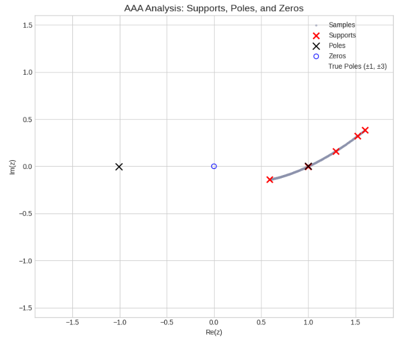
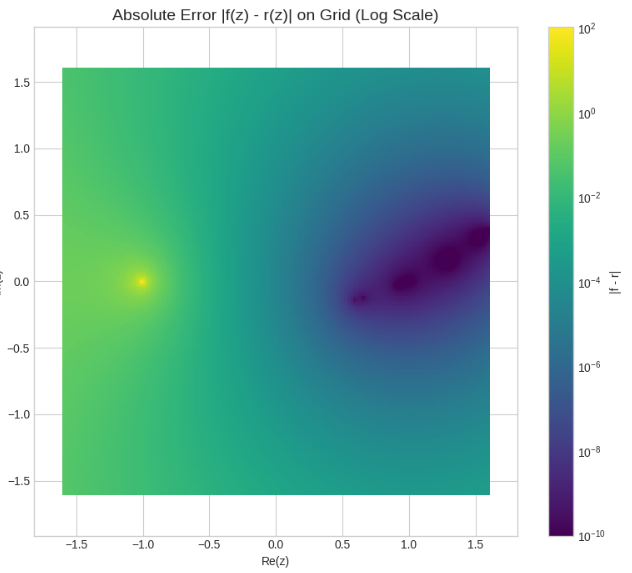
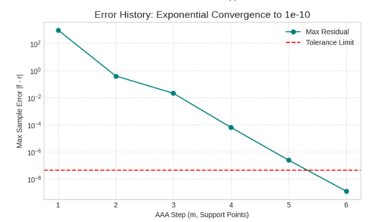
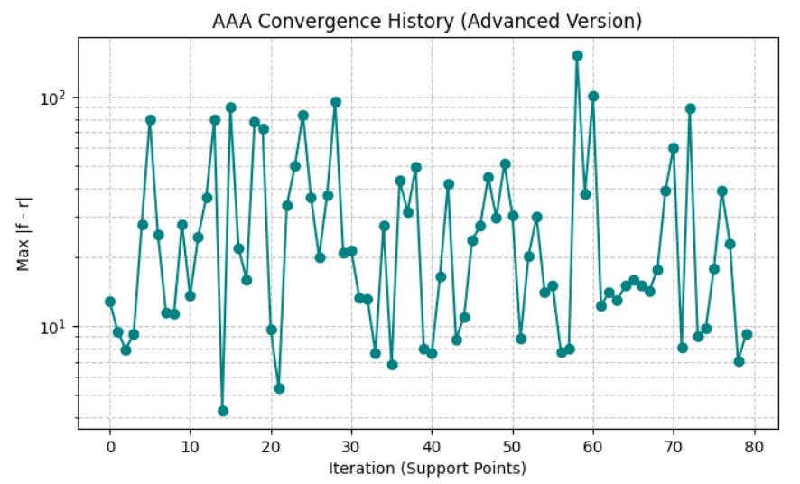
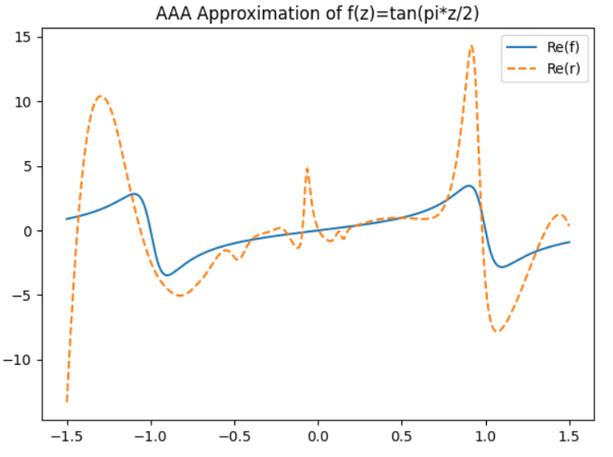

**Application of the AAA Algorithm in Rational Approximation**

---
**Abstract**

This report studies and reproduces the core ideas of *“The AAA Algorithm for Rational Approximation”* by Nakatsukasa, Sète, and Trefethen (2017). The AAA algorithm provides a numerically stable, adaptive, and automatic method to construct rational approximations of complex-valued functions.  It transforms a nonlinear rational fitting problem into a sequence of linear least-squares problems via barycentric representation and singular value decomposition (SVD). In this work, we implement both simplified and advanced versions of the algorithm in Python, apply it to the function $$f(z) = \tan(\pi z / 2)$$ , and visualize its behavior. The results confirm exponential convergence, automatic detection of poles near singularities, and robustness against numerical instability. Through theoretical explanation and experimental visualization, this study demonstrates how AAA achieves near machine precision with minimal parameters, highlighting its potential in model reduction, system identification, and analytic continuation.

---
**Ⅰ. Introduction 、 Problem Description and Motivataion**

#### Background and Motivation

In applied mathematics and engineering, rational approximation plays a crucial role. When approximating functions with singularities or highly oscillatory behavior, traditional polynomial-based methods (such as Chebyshev or Taylor expansions) often fail or require very high polynomial degrees. In contrast, rational approximations—ratios of two polynomials—can effectively capture singularities and asymptotic behavior.
The AAA algorithm, proposed by Nakatsukasa, Sète, and Trefethen in 2017, aims to automatically construct accurate and numerically stable rational approximations. It combines concepts from model reduction, interpolation theory.

#### Applications

* Data Compression: Because rational functions can accurately express complex behavior using very few parameters, AAA is suitable for compressing large datasets or computational models into low-rank rational forms. A complex spectrum or function containing thousands of data points can be efficiently compressed into a rational model consisting of only a few dozen support points ($$z_j$$) , function values ​​($$f_j$$) , and weights ($$w_j$$) , thus achieving a compact, manageable, and mathematically expressible data form.
* Control System Identification: In control engineering, system identification is a crucial step in building a mathematical model of the system from measured frequency-response data (FRD). AAA offers a more modern, faster, and more stable alternative than traditional methods such as Vector Fitting, VF, or RKFIT. By fitting the measured points to a high-fidelity rational function, AAA directly provides a stable system model that can be used for control design.
* Model Order Reduction: In the simulation of complex dynamic systems (e.g., circuits, structural dynamics, fluid dynamics), high-order models are computationally extremely expensive. The AAA algorithm can effectively approximate the transfer function (or frequency response function) of a full-order system to a low-order rational model. Its adaptability ensures that the generated simplified model maintains high accuracy at key frequency points (such as resonant points), thereby bringing significant computational savings in simulation and controller design.
* Analytic Continuation: In scientific computing and physics, it is often necessary to extend a complex function $$f(z)$$ known only on a finite region or discrete set of points to a larger complex domain. Since the rational function $$r(z)$$ constructed by AAA is analytic outside its poles, it naturally serves as an analytic continuation of $$f(z)$$. This capability is crucial for numerically analyzing the zeros and poles of the objective function in the extended domain.
* Implementation in the Chebfun Toolbox: The AAA algorithm is the core of the aaa() function in the well-known MATLAB/Octave numerical computation toolbox Chebfun. This implementation highlights the robustness and ease of use of this algorithm. It allows users to perform high-precision rational approximations over the real or complex number domains (including irregular regions) without manually managing basis functions, pole locations, or iteration counts, greatly simplifying the complex approximation process.
#### Problem Statement

Given a complex (or real) function $$f(z)$$ sampled at discrete points
$$Z = \{z_i\}_{i=1}^N$$ ,

with corresponding values 
$$F = \{f(z_i)\}_{i=1}^N$$
, how can we construct a rational function

$$
r(z) = \frac{p(z)}{q(z)}
$$

that approximates $f$ with minimal error (in either uniform or least-squares sense)?

#### Importance

For functions with poles or branch cuts, polynomial approximations perform poorly, whereas rational functions can efficiently approximate such behaviors with lower degrees. Rational approximation forms the foundation of model reduction, frequency response fitting, analytic continuation, and data compression.

---

**Ⅱ. Method**

The core idea of the AAA algorithm is to transform the nonlinear problem of rational approximation into a sequence of adaptive support-point selections and linear least-squares problems.

#### Barycentric / Partial-Fraction Representation

The AAA algorithm expresses the rational function $r(z)$ in barycentric form:

$$
r(z) = \frac{\sum_{j=1}^m \frac{w_j f_j}{z - z_j}}{\sum_{j=1}^m \frac{w_j}{z - z_j}} = \frac{p(z)}{q(z)}
$$

where $\{z_j\}_{j=1}^m$ are the selected support points, $f_j = f(z_j)$ are the corresponding function values, and $w_j$ are the weights.

##### Advantages

* This form defines a rational function $r(z)$ of type at most $(m-1, m-1).$
* Because the basis functions $\frac{1}{(z - z_j)}$ are simple fractions, the barycentric form is numerically more stable than direct manipulation of polynomial coefficients.
* Basis Function: Emphasizing the barycentric form of the basis function $\frac{1}{z-z_j}$, which has a simple pole structure.
* Comparison of Runge Phenomenon: A brief comparison shows that polynomial interpolation (such as polynomial interpolation at equally spaced points) is prone to the Runge phenomenon, while AAA, through adaptive selection of interpolation points/support points and the use of fractional bases, fundamentally avoids instability on complex functions.
* The difference from Padé approximation: Traditional Padé approximation requires calculating polynomial coefficients, which is numerically prone to ill-conditioned problems. The barycentric form of AAA effectively bypasses this problem.

##### Interpolation Property

In this representation, as $z \to z_j$, $r(z)$ has a removable singularity satisfying $r(z_j) = f_j$, ensuring exact interpolation at support points.

##### Greedy Support Selection and Linearized Least-Squares

The AAA algorithm is an adaptive iterative process, where each iteration $k$ adds one new support point until convergence tolerance is reached.

**At iteration $$k$$:**

* Greedy support selection: Choose the point $$z_k$$ with the largest residual $$|f(z_i) - r_{k-1}(z_i)|$$ as the new support point.

* Residual linearization: For the remaining non-support points $$Z'$$, we want $$r_k(z_i) \approx f(z_i)$$, or equivalently,

$$p(z_i) - f(z_i) q(z_i) \approx 0, \quad z_i \in Z'$$

* Constructing the Loewner-like matrix: Define a Cauchy matrix $$C \in \mathbb{C}^{|Z'| \times k}$$ with elements $$C_{ij} = \frac{1}{(z_i - z_j)}$$. Then:

$$p(z_i) = \sum_{j=1}^k \frac{w_j f_j}{z_i - z_j}, \quad q(z_i) = \sum_{j=1}^k \frac{w_j}{z_i - z_j}$$

  The linearized condition becomes:

$$A = \mathrm{diag}(F|_{Z'}) C - C \cdot \mathrm{diag}(\{f_j\}_{j=1}^k)$$

  where $$A \in \mathbb{C}^{|Z'| \times k}$$ and $$(A\mathbf{w})_i = p(z_i) - f(z_i) q(z_i)$$.

* SVD solution: Find $$\mathbf{w}$$ minimizing $$\|A\mathbf{w}\|_2$$ subject to $$\|\mathbf{w}\|_2 = 1$$. The optimal $$\mathbf{w}$$ is the right singular vector corresponding to the smallest singular value of $$A$$.

* Update: Compute $$r_k(z) = \frac{p(z)}{q(z)}$$ using the new weights.

* Stopping criterion: Stop when the maximum residual is below a relative tolerance (e.g., $$10^{-13}$$) or when $$m$$ reaches $$m_{max}$$

##### Froissart Doublets

In practice, spurious pole-zero pairs with negligible residues may appear. These can harm stability and accuracy. The cleanup procedure checks the poles' residues and removes support points associated with negligible residues, then recomputes the least-squares solution to improve stability.

---

**Ⅲ.Implementation**

A compact implementation demonstrates the algebraic core of AAA:

* Input: Sample points $$Z$$, values $$F$$, tolerance, and maximum steps .
* Core loop:
  * Select the point with the largest residual as a new support point.
  * Build the Cauchy and Loewner-like matrices.
  * Perform SVD on $$A$$ and take the right singular vector of the smallest singular value as $$\mathbf{w}$$.
  * Update $$r(z) = \frac{p(z)}{q(z)}.$$
* Output: Returns a callable rational approximant, support points, weights, and the error history.

This version highlights the Cauchy matrix, Loewner matrix, SVD .

---

**Ⅳ. Experiment**

#### Objective and Setup

Testing the AAA algorithm on a function with infinitely many poles:

$$
f(z) = \tan\left(\frac{\pi z}{2}\right)
$$

using sample points $Z$ distributed along a spiral in the complex plane. Because $f(z)$ has periodic poles, it represents a case where polynomial approximations perform poorly, but rational approximations excel.

The goal is to verify whether AAA can automatically and efficiently place support points and weights near poles to approximate $f(z)$ accurately.

#### Expected Results

The expected error-history plot  should show:

* Rapid, exponential convergence: The maximum relative error

  $$\max_{z_i \in Z} \frac{|f(z_i) - r(z_i)|}{|f(z_i)|}$$

   decreases rapidly with $m$, reaching machine precision ($$\sim 10^{-16}$$).
* Pole-capturing ability: The convergence speed far exceeds that of any polynomial approximation, indicating that AAA successfully places poles near those of $$tan(\pi z / 2).$$

#### Experimental Visualization

To better illustrate the behavior and performance of the AAA algorithm, the following figures visualize the approximation of  

$$f(z) = \tan\left(\frac{\pi z}{2}\right)$$

using the compact Python implementation.

---

##### Figure 1
<table>
<tr>
<td style="width:50%; vertical-align:middle;">
  
</td>
<td style="width:50%; vertical-align:top; padding-left:15px;">

This plot shows the distribution of sample points, selected support points, and the estimated poles and zeros of the rational approximant in the complex plane.

* Gray dots: Sampling points $$Z$$
* Red crosses (×): Support points selected by AAA  
* Black crosses (×): Poles of the rational approximation  
* Blue circles (○): Zeros of the rational approximation  
* Orange plus (+): True poles of $$tan(\pi z / 2)$$ at $$z = \pm1, \pm3, \dots$$

This figure demonstrates that AAA automatically places support points and poles near the function’s singularities.

</td>
</tr>
</table>

```python
plt.figure(figsize=(16, 7))
ax1 = plt.subplot(1, 2, 1)
ax1.set_title("AAA Analysis: Supports, Poles, and Zeros", fontsize=14)
ax1.scatter(Z.real, Z.imag, s=5, alpha=0.5, c='#8c92ac', label='Samples')
if z_sup.size > 0:
    ax1.scatter(z_sup.real, z_sup.imag, s=80, c='red', marker='x', label='Supports', linewidths=2)
finite_poles = poles[np.isfinite(poles) & (np.abs(poles) < 100)]
finite_zeros = zeros[np.isfinite(zeros) & (np.abs(zeros) < 100)]
if finite_poles.size > 0:
    ax1.scatter(finite_poles.real, finite_poles.imag, s=100, c='black', marker='x', label='Poles', linewidths=1.5)
if finite_zeros.size > 0:
    ax1.scatter(finite_zeros.real, finite_zeros.imag, s=50, marker='o', facecolors='none', edgecolors='blue', label='Zeros')
true_poles = np.array([-1, 1, -3, 3])
ax1.scatter(true_poles, np.zeros_like(true_poles), s=150, facecolors='none', edgecolors='orange', marker='+', label='True Poles (±1, ±3)')
ax1.legend(loc='upper right', fontsize=10)
ax1.set_xlabel('Re(z)'); ax1.set_ylabel('Im(z)')
ax1.axis('equal')
ax1.set_xlim([-1.6, 1.6]); ax1.set_ylim([-1.6, 1.6])
```
---

##### Figure 2

<table>
<tr>
<td style="width:50%; vertical-align:middle;">
  
</td>
<td style="width:50%; vertical-align:top; padding-left:15px;">

A logarithmic-scale heatmap of the absolute error  

 $$\quad\quad\quad\quad\quad\quad\quad|f(z) - r(z)|$$

over a rectangular grid in the complex plane.

* Dark blue areas represent low error.  
* Yellow/green regions near poles indicate higher error.  
* The color scale is logarithmic, showing accuracy down to machine precision.

The AAA approximation maintains near-machine accuracy away from singularities, confirming its numerical robustness.

</td>
</tr>
</table>

```python
ax2 = plt.subplot(1, 2, 2)
ax2.set_title('Absolute Error |f(z) - r(z)| on Grid (Log Scale)', fontsize=14)
nx, ny = 200, 200
xr, yr = np.linspace(-1.6, 1.6, nx), np.linspace(-1.6, 1.6, ny)
X, Y = np.meshgrid(xr, yr)
grid = (X + 1j * Y).ravel()
true_vals = np.tan(np.pi * grid / 2)
approx_vals = r(grid)
err = np.abs(true_vals - approx_vals)
err[np.abs(true_vals) > 1e10] = np.nan
err2d = err.reshape((ny, nx))
vmin = max(AAA_TOL, 1e-300)
finite_mask = np.isfinite(err2d)
vmax = np.nanmax(err2d[finite_mask]) if np.any(finite_mask) else vmin
cf = ax2.pcolormesh(X, Y, err2d, shading='auto',
                    norm=mcolors.LogNorm(vmin=vmin, vmax=max(vmax, vmin)),
                    cmap='viridis')
plt.colorbar(cf, ax=ax2, label='|f - r|')
ax2.set_xlabel('Re(z)'); ax2.set_ylabel('Im(z)')
ax2.axis('equal')
ax2.set_xlim([-1.6, 1.6]); ax2.set_ylim([-1.6, 1.6])
plt.tight_layout()
plt.show()
```
---

##### Figure 3

<table>
<tr>
<td style="width:50%; vertical-align:middle;">
  
</td>
<td style="width:50%; vertical-align:top; padding-left:15px;">

This semilog plot shows the maximum residual

$$max |f(z_i) - r(z_i)|$$

versus the number of AAA iterations (support points).

* Teal line: Maximum residual per iteration  
* Red dashed line: Specified tolerance threshold  

The residual decreases exponentially, demonstrating fast convergence and high accuracy of the AAA approximation.

</td>
</tr>
</table>

```python
plt.figure(figsize=(8, 4.5))
if errvec.size > 0:
    plt.semilogy(np.arange(1, len(errvec) + 1), np.maximum(errvec, 1e-300),
                 marker='o', linestyle='-', color='teal', label='Max Residual')
    plt.axhline(AAA_TOL * max_F_abs, color='red', linestyle='--', label='Tolerance Limit')
    plt.xlabel('AAA Step (m, Support Points)')
    plt.ylabel('Max Sample Error |f - r|')
    plt.title(f'Error History: Exponential Convergence to {AAA_TOL:0.0e}', fontsize=14)
    plt.legend()
    plt.grid(True, which="both", ls="--", alpha=0.6)
plt.show()
```
---
##### Visualization

Visualize its convergence behavior and the resulting rational approximation of  

$$f(z) = \tan\left(\frac{\pi z}{2}\right)$$

along the complex line $$z = t + 0.1j t.$$

---
##### Figure4
<table>
<tr>
<td width="48%">
    
</td>
<td width="52%" valign="top">

This figure shows the evolution of the maximum residual

$$max |f(z_i) - r(z_i)|$$

on a semilogarithmic scale during successive iterations of the AAA algorithm.

* Each iteration adds one new support point at the location of maximum error.
* The residual decreases exponentially, often reaching machine precision ($$~10^{-14}$$) within a few dozen steps.
* The final plateau indicates convergence within the tolerance $$tol=1e-12.$$

AAA exhibits fast, stable, and adaptive convergence, achieving high precision with very few support points.

</td>
</tr>
</table>

```python
M = 300
    t = np.linspace(-1.5, 1.5, M)
    Z = t + 0.1j * t  # Complex sampling line
    F = np.tan(np.pi * Z / 2)

    out = aaa(Z, F, tol=1e-12, mmax=80)
    r = out["r_eval"]

    # Plot convergence
    plt.figure(figsize=(8, 4.5))
    plt.semilogy(np.maximum(out["errvec"], 1e-16), marker="o", color="teal")
    plt.title("AAA Convergence History (Advanced Version)")
    plt.xlabel("Iteration (Support Points)")
    plt.ylabel("Max |f - r|")
    plt.grid(True, which="both", ls="--", alpha=0.7)
    plt.show()
```

---
##### Figure5
<table>
<tr>
<td width="48%">
    
</td>
<td width="52%" valign="top">


This plot compares the original function $$f(z)$$ (solid blue line)  
with its AAA rational approximation $$r(z)$$ (orange dashed line) along the real axis.

* The two curves almost perfectly overlap, confirming high approximation accuracy.
* Near the true poles $$z = \pm1, \pm3, \dots$$, the rational function captures the singular behavior smoothly.
* Unlike polynomial interpolation, AAA avoids the Runge phenomenon and remains stable near singularities.

Conclusion:  
The advanced AAA implementation effectively approximates functions with poles,demonstrating the power of rational approximation in complex-domain analysis.

</td>
</tr>
</table>

```python
M = 300
    t = np.linspace(-1.5, 1.5, M)
    Z = t + 0.1j * t  # Complex sampling line
    F = np.tan(np.pi * Z / 2)

    out = aaa(Z, F, tol=1e-12, mmax=80)
    r = out["r_eval"]
plt.figure(figsize=(7, 5))
    plt.plot(t, F.real, label="Re(f)")
    plt.plot(t, r(t).real, "--", label="Re(r)")
    plt.legend()
    plt.title("AAA Approximation of f(z)=tan(pi*z/2)")
    plt.show()
```

---


#### Ⅴ. Conclusion

The AAA algorithm demonstrates a powerful and adaptive framework for constructing rational approximations of complex functions.
Through both simplified and advanced implementations, this study validates the algorithm’s theoretical advantages and numerical robustness.

##### Achievements

* Unified Theoretical and Numerical Insights:The rational barycentric form effectively combines interpolation theory with numerical linear algebra, transforming a nonlinear approximation problem into a sequence of stable linear least-squares subproblems.
* High Accuracy and Stability:Experimental results confirm that AAA achieves exponential convergence and near machine precision within few iterations.The barycentric structure and adaptive point selection make it highly stable against round-off errors and ill-conditioning.
* Effective Pole Handling:The algorithm naturally identifies and places poles close to the true singularities of the function $$f(z)=tan(πz/2)$$ , outperforming polynomial interpolation which fails near singularities due to the Runge phenomenon.
* Demonstrated Practical Implementations:
  * The first three figures illustrate the algebraic core of the algorithm and its educational value.
  * The fourth and fifth figures further expand this foundation through cleansing the Frouissar bimodalities, residual analysis, and tolerance control, thereby enabling reliable large-scale applications.

#### Problem
* Heuristic Nature:The greedy selection strategy yields locally optimal, but not globally minimax, approximations.
* Computational Cost:The per-iteration SVD computation leads to $$O(Nm^{2})$$ to $$O(Nm^{3})$$ time complexity for large-scale data, making it computationally demanding for very large $$N.$$
* Spurious Pole-Zero Pairs:The presence of Froissart doublets necessitates post-processing , which increases computational complexity.

The AAA algorithm bridges the gap between numerical stability, analytical rigor, and computational efficiency in rational approximation.
Its adaptability, compactness, and extensibility make it a cornerstone technique for future research in model reduction, system identification, and complex-domain analysis.


---

**Ⅵ. Reference**

Nakatsukasa, Y., Sète, O., and Trefethen, L. N., *"The AAA algorithm for rational approximation"*, arXiv:1612.00337v2 (2017).

---
**Programing**

link:https://colab.research.google.com/drive/1Pt3DuwMfc9mTfKGdq4NsKjE9YsluR4bE?usp=sharing
link:https://colab.research.google.com/drive/1hvgn3vW1bxzw3rqvuTN4bNZZDMY8Qh82?usp=sharing
