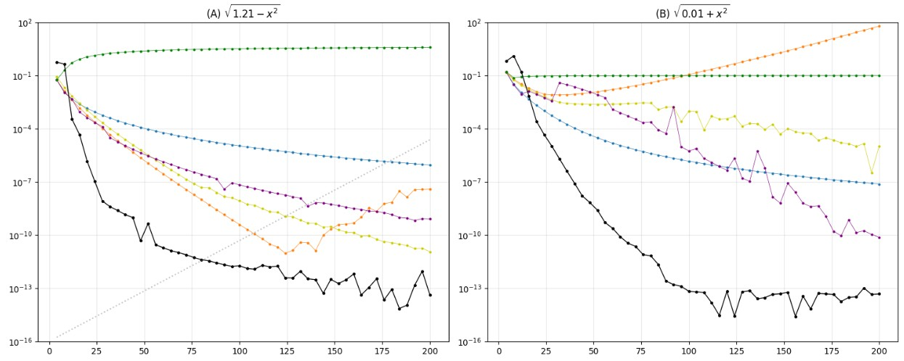
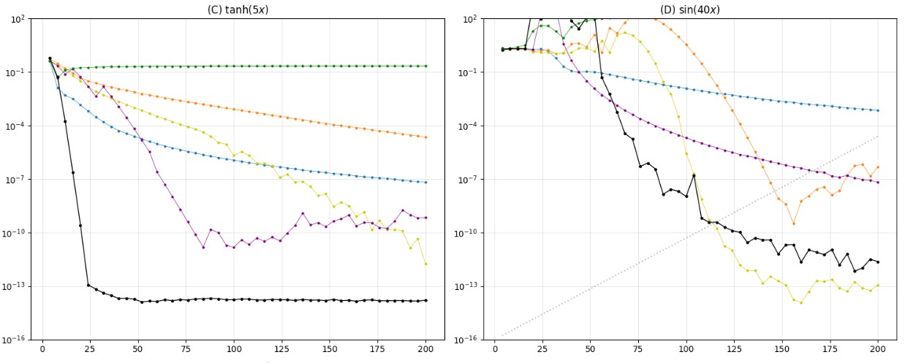
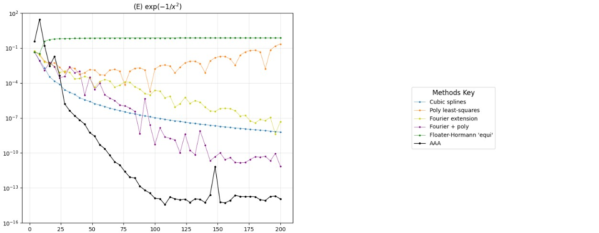
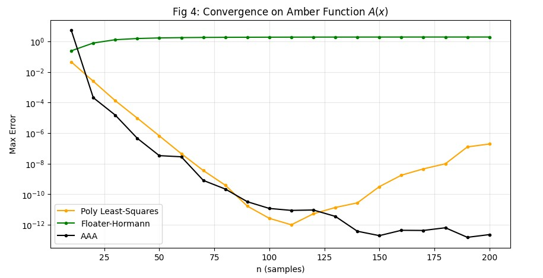
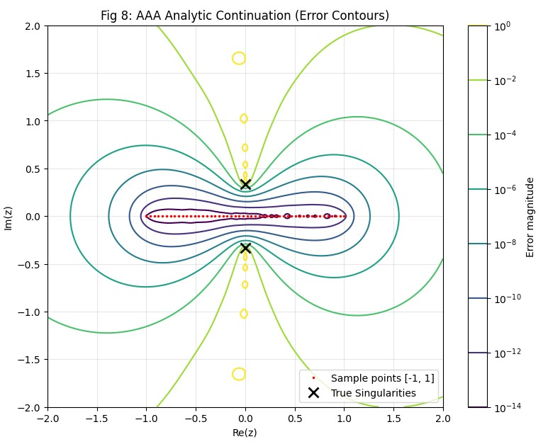

**About**

This paper addresses the problem of interpolating real or complex data sampled at equispaced points on the interval $$[-1,1]$$.

Core idea of the AAA method

The AAA algorithm computes a rational approximation to the given data with a default relative tolerance of $$10^{-13}$$. In MATLAB (Chebfun), the basic command is


$$r = aaa(F)$$


If a polynomial rather than a rational function is required, the rational approximant can be converted afterward.

<br></br>

**Numerical interpolant vs. exact interpolation**

The output of AAA is generally not a mathematically exact interpolant (i.e., it does not necessarily have degree $$n-1$$). Instead, it produces a numerical interpolant. This distinction is crucial for robustness.

Example (Fig. 1)

Consider

$$
f(x) = \frac{e^x}{\sqrt{1+9x^2}}
$$

sampled at 50 equispaced points. AAA produces a degree-17 rational function with an error of only

$$
9.6 \times 10^{-14}.
$$

By contrast, the exact degree-49 polynomial interpolant suffers from severe Runge phenomena, with an error as large as

$$
109.3.
$$

**Accuracy–stability tradeoff**

For equispaced data, there is a fundamental tradeoff between accuracy and stability. An impossibility theorem states that

* Exponential convergence typically comes with exponential instability.
* Stable algorithms can achieve at best root-exponential convergence, $$exp(-C\sqrt{n}).$$


<br></br>

**Existing Methods**

The paper compares AAA against five major competing approaches.

* Polynomial Least Squares (PLS)

  Direct polynomial interpolation with degree $$d=n-1$$ leads to error growth of order

$$
O(2^n).
$$

  $$\quad$$ $$\quad$$ Using a reduced degree $$d \approx n/\gamma$$ with oversampling factor $$\gamma>1$$ mitigates this instability. For example, when $$\gamma=2$$, the growth rate is 
  $$\quad$$ $$\quad$$ $$\quad$$ reduced to approximately

$$
(1.14)^n.
$$

* Fourier Extension

   The function is approximated by a Fourier series defined on an extended interval $$[-T,T]$$. In the experiments, $$T=2$$ , oversampling factor $$=2$$ are used.

* Fourier Series with Corrections

  This method combines a trigonometric approximation with polynomial correction terms to handle endpoint discontinuities. In the experiments, the Fourier series is augmented by a polynomial of degree approximately $$\sqrt{n}$$.

* Splines

  Cubic splines are employed. They are extremely stable but converge only algebraically, with a fixed rate of

$$
O(n^{-4}).
$$

* Floater–Hormann Rational Interpolation (Chebfun `equi`)

  This is a barycentric rational interpolant guaranteed to have no poles in $$[-1,1]$$. Chebfun’s `equi` option adaptively selects the interpolation degree.

<br></br>

**Numerical Comparison**


AAA is compared with the five methods above using the following five test functions:

* $$f_A(x) = \sqrt{1.21 - x^2}$$ (branch points at $$\pm1.1$$)
* $$f_B(x) = \sqrt{0.01 + x^2}$$ (branch points at $$\pm0.1i$$, very close to the real axis)
* $$f_C(x) = \tanh(5x)$$ (poles on the imaginary axis)
* $$f_D(x) = \sin(40x)$$ (entire function, highly oscillatory)
* $$f_E(x) = \exp(-1/x^2)$$ ($$C^\infty$$ but not analytic)

Main results (Fig. 2)

```python
import numpy as np
import matplotlib.pyplot as plt
from scipy.interpolate import CubicSpline
from scipy.linalg import lstsq
import warnings
import sys


warnings.filterwarnings('ignore')


def aaa(Z, F, tol=1e-13, mmax=100):
    Z = np.asanyarray(Z)
    F = np.asanyarray(F)
    mask = np.isfinite(F)
    Z, F = Z[mask], F[mask]
    J = []  
    z = []  
    f = []  
    C = []  
    R = np.mean(F) * np.ones_like(F)
    
    for m in range(mmax):
        err = F - R
        j = np.argmax(np.abs(err))
        max_err = np.abs(err[j])
        if max_err <= tol * np.linalg.norm(F, np.inf):
            break
            
        J.append(j)
        z.append(Z[j])
        f.append(F[j])
        

        with np.errstate(divide='ignore', invalid='ignore'):
            current_C = 1.0 / (Z - Z[j])
        current_C[j] = 0
        C.append(current_C)
        m_curr = len(z)
        A = np.zeros((len(Z), m_curr), dtype=complex)
        for i in range(m_curr):
            with np.errstate(divide='ignore', invalid='ignore'):
                col = (F - f[i]) / (Z - z[i])
            col[J] = 0 
            A[:, i] = col

        mask_J = np.ones(len(Z), dtype=bool)
        mask_J[J] = False
        A_reduced = A[mask_J, :]
        
        if A_reduced.shape[0] < A_reduced.shape[1]:
             break 

        try:
            U, S, Vh = np.linalg.svd(A_reduced)
            w = Vh[-1, :].conj()
        except np.linalg.LinAlgError:
            break

        def r_handle(zz):
            zz = np.asanyarray(zz)
            num = np.zeros_like(zz, dtype=complex)
            den = np.zeros_like(zz, dtype=complex)
            
            for i in range(len(w)):
                with np.errstate(divide='ignore', invalid='ignore'):
                    term = w[i] / (zz - z[i])
                term[np.isinf(term)] = 0
                num += term * f[i]
                den += term
            

            with np.errstate(divide='ignore', invalid='ignore'):
                res = num / den
            

            for i, idx in enumerate(J):
                mask_close = np.isclose(zz, z[i], atol=1e-13)
                if np.any(mask_close):
                    res[mask_close] = f[i]
            return res

        R = r_handle(Z)
        
    return locals().get('r_handle', lambda x: np.mean(F) * np.ones_like(x))

def floater_hormann(x_eval, x_nodes, y_nodes, d=3):
    n = len(x_nodes)
    d = min(d, n - 1)
    w = np.zeros(n)
    

    for k in range(n):
        s = 0.0
        i_min = max(0, k - d)
        i_max = min(n - 1 - d, k)
        for i in range(i_min, i_max + 1):
            prod = 1.0
            for j in range(i, i + d + 1):
                if j != k:
                    prod *= 1.0 / np.abs(x_nodes[k] - x_nodes[j])
            if (i % 2) == 1: s -= prod
            else: s += prod
        w[k] = (-1.0)**k * s

    num = np.zeros_like(x_eval)
    den = np.zeros_like(x_eval)
    
    for k in range(n):
        with np.errstate(divide='ignore'):
            term = w[k] / (x_eval - x_nodes[k])

        mask_inf = np.isinf(term)
        term[mask_inf] = 0
        num += term * y_nodes[k]
        den += term
        
    with np.errstate(divide='ignore', invalid='ignore'):
        res = num / den
        

    for k in range(n):
        mask_hit = np.isclose(x_eval, x_nodes[k], atol=1e-14)
        if np.any(mask_hit):
            res[mask_hit] = y_nodes[k]
            
    return res


def get_func(index, x):
    if index == 0: return np.sqrt(1.21 - x**2)
    if index == 1: return np.sqrt(0.01 + x**2)
    if index == 2: return np.tanh(5 * x)
    if index == 3: return np.sin(40 * x)
    if index == 4: return np.exp(-1 / x**2)
    return np.zeros_like(x)

func_names = [
    r'(A) $\sqrt{1.21-x^2}$', r'(B) $\sqrt{0.01+x^2}$',
    r'(C) $\tanh(5x)$', r'(D) $\sin(40x)$',
    r'(E) $\exp(-1/x^2)$'
]

xx = np.linspace(-1, 1, 1000)
fig = plt.figure(figsize=(15, 18))


for plot_idx in range(5):
    f_func = lambda x: get_func(plot_idx, x)
    true_vals = f_func(xx)
    n_values = np.arange(4, 201, 4)
    errs = {k: [] for k in ['spline', 'poly', 'fourier_ext', 'fourier_poly', 'floater', 'aaa']}
    
    print(f"[{plot_idx+1}/5] Processing {func_names[plot_idx]}...")
    
    for n in n_values:
        X = np.linspace(-1, 1, n)
        F = f_func(X)
        
        # 1. Cubic Splines
        try:
            cs = CubicSpline(X, F)
            errs['spline'].append(np.linalg.norm(true_vals - cs(xx), np.inf))
        except: errs['spline'].append(np.nan)
        
        # 2. Polynomial Least-Squares (gamma=2)
        try:
            deg = int(n / 2)
            T_mat = np.polynomial.chebyshev.chebvander(X, deg)
            c, _, _, _ = lstsq(T_mat, F, lapack_driver='gelsy')
            T_eval = np.polynomial.chebyshev.chebvander(xx, deg)
            p_vals = T_eval @ c
            errs['poly'].append(np.linalg.norm(true_vals - p_vals, np.inf))
        except: errs['poly'].append(np.nan)

        # 3. Fourier Extension to [-2, 2]
        try:
            M_modes = int(np.ceil(n / 4))
            k_vec = np.arange(-M_modes, M_modes + 1)
            A = np.exp(1j * np.pi * np.outer(X, k_vec) / 2.0)
            c, _, _, _ = lstsq(A, F, lapack_driver='gelsy')
            A_eval = np.exp(1j * np.pi * np.outer(xx, k_vec) / 2.0)
            f_vals = np.real(A_eval @ c)
            errs['fourier_ext'].append(np.linalg.norm(true_vals - f_vals, np.inf))
        except: errs['fourier_ext'].append(np.nan)

        # 4. Fourier + Low Degree Poly
        try:
            deg_p = int(np.round(np.sqrt(n)))
            deg_p = deg_p + (deg_p + n + 1) % 2 
            deg_f = (n - 1 - deg_p) // 2
            
            T_mat = np.polynomial.chebyshev.chebvander(X, deg_p)
            if deg_f > 0:
                k_f = np.arange(1, deg_f + 1)
                Cos_mat = np.cos(np.pi * np.outer(X, k_f))
                Sin_mat = np.sin(np.pi * np.outer(X, k_f))
                A = np.hstack([Cos_mat, Sin_mat, T_mat])
            else:
                A = T_mat
            c, _, _, _ = lstsq(A, F, lapack_driver='gelsy')
            T_eval = np.polynomial.chebyshev.chebvander(xx, deg_p)
            if deg_f > 0:
                Cos_eval = np.cos(np.pi * np.outer(xx, k_f))
                Sin_eval = np.sin(np.pi * np.outer(xx, k_f))
                A_eval = np.hstack([Cos_eval, Sin_eval, T_eval])
            else:
                A_eval = T_eval
            vals = A_eval @ c
            errs['fourier_poly'].append(np.linalg.norm(true_vals - vals, np.inf))
        except Exception as e: 
            errs['fourier_poly'].append(np.nan)

        # 5. Floater-Hormann (d=3)
        try:
            fh_vals = floater_hormann(xx, X, F, d=3)
            errs['floater'].append(np.linalg.norm(true_vals - fh_vals, np.inf))
        except: errs['floater'].append(np.nan)

        # 6. AAA
        try:
            r = aaa(X, F, tol=1e-13)
            aaa_vals = np.real(r(xx))
            errs['aaa'].append(np.linalg.norm(true_vals - aaa_vals, np.inf))
        except: errs['aaa'].append(np.nan)


    ax = plt.subplot(3, 2, plot_idx + 1)
    ax.semilogy(n_values, errs['spline'], '.-', lw=0.5, ms=4, label='Cubic splines')
    ax.semilogy(n_values, errs['poly'], '.-', lw=0.5, ms=4, label='Poly least-squares')
    ax.semilogy(n_values, errs['fourier_ext'], '.-', lw=0.5, ms=4, color='#CCCC00', label='Fourier extension')
    ax.semilogy(n_values, errs['fourier_poly'], '.-', lw=0.5, ms=4, color='purple', label='Fourier + poly')
    ax.semilogy(n_values, errs['floater'], '.-', lw=0.5, ms=4, color='green', label="Floater-Hormann 'equi'")
    ax.semilogy(n_values, errs['aaa'], 'k.-', lw=1.0, ms=5, label='AAA')

    # Instability reference for A and D
    if plot_idx in [0, 3]:
        instability = 1e-16 * (1.14)**n_values
        ax.semilogy(n_values, instability, ':', color='gray', alpha=0.5)

    ax.set_title(func_names[plot_idx])
    ax.grid(True, alpha=0.3)
    ax.set_ylim(1e-16, 100)


ax_legend = plt.subplot(3, 2, 6)
ax_legend.axis('off')

l1, = ax_legend.plot([], [], '.-', lw=0.5, ms=4, label='Cubic splines') # 預設藍色
l2, = ax_legend.plot([], [], '.-', lw=0.5, ms=4, label='Poly least-squares') # 預設橘色
l3, = ax_legend.plot([], [], '.-', lw=0.5, ms=4, color='#CCCC00', label='Fourier extension')
l4, = ax_legend.plot([], [], '.-', lw=0.5, ms=4, color='purple', label='Fourier + poly')
l5, = ax_legend.plot([], [], '.-', lw=0.5, ms=4, color='green', label="Floater-Hormann 'equi'")
l6, = ax_legend.plot([], [], 'k.-', lw=1.0, ms=5, label='AAA')

legend = ax_legend.legend(handles=[l1, l2, l3, l4, l5, l6], 
                          loc='center', 
                          fontsize='medium', 
                          frameon=True, # 顯示圖例邊框
                          title="Methods Key")
legend.get_title().set_fontsize('large')

plt.tight_layout()
plt.show()
```







* Dominance of AAA:AAA outperforms all other methods in almost every case and is consistently the first to reach an accuracy of $$10^{-10}$$.

* Capturing singularities: For $$f_C(x)=\tanh(5x)$$, AAA rapidly detects the nearby poles, leading to extremely fast convergence.

* Numerical interpolation behavior:For small $$n$$, AAA behaves like an exact interpolant. As $$n$$ increases, it transitions into a numerical interpolant: the error at grid points remains around $$10^{-13}$$ while avoiding overfitting.

* Handling spurious poles (AAA-LS):If AAA produces undesirable poles inside $$[-1,1]$$, the paper proposes AAA–Least Squares (AAA-LS):

1. Remove the bad poles.
2. Retain the remaining poles as a basis.
3. Recompute the approximation via least squares.


<br></br>
**Convergence Properties**

**Typical AAA convergence phases**

Initial phase (small $$n$$) : Resolution is insufficient; spurious poles may appear, triggering a switch to least squares.Rapid convergence phase (middle phase): This is where AAA excels. It exploits the analytic structure (poles, branch points). Grid-point errors are around $$10^{-13}$$, while inter-grid errors may still be larger (e.g., $$10^{-6}$$). As $$n$$ increases, the spacing shrinks and the global error rapidly decreases.Leveling-off phase: The error plateaus due to the prescribed tolerance of $$10^{-13}$$.


The Amber function test (Figs. 3–4)

The authors construct an "Amber function" $$A(x)$$ whose coefficients are determined by the binary digits of $$\pi$$. It is analytic inside a Bernstein 2-ellipse but has essentially no exploitable structure.

```python
import numpy as np
import matplotlib.pyplot as plt
from scipy.linalg import lstsq
import warnings
from matplotlib.colors import LogNorm

warnings.filterwarnings('ignore')


def aaa(Z, F, tol=1e-13, mmax=100):
    """ AAA 演算法實作 """
    Z = np.asanyarray(Z)
    F = np.asanyarray(F)
    mask = np.isfinite(F)
    Z, F = Z[mask], F[mask]
    
    J = []
    z = []
    f = []
    C = []
    R = np.mean(F) * np.ones_like(F)
    
    for m in range(mmax):
        err = F - R
        j = np.argmax(np.abs(err))
        max_err = np.abs(err[j])
        if max_err <= tol * np.linalg.norm(F, np.inf):
            break
            
        J.append(j)
        z.append(Z[j])
        f.append(F[j])
        
        with np.errstate(divide='ignore', invalid='ignore'):
            current_C = 1.0 / (Z - Z[j])
        current_C[j] = 0
        C.append(current_C)
        
        m_curr = len(z)
        A = np.zeros((len(Z), m_curr), dtype=complex)
        for i in range(m_curr):
            with np.errstate(divide='ignore', invalid='ignore'):
                col = (F - f[i]) / (Z - z[i])
            col[J] = 0
            A[:, i] = col
            
        mask_J = np.ones(len(Z), dtype=bool)
        mask_J[J] = False
        A_reduced = A[mask_J, :]
        
        if A_reduced.shape[0] < A_reduced.shape[1]: break
            
        try:
            U, S, Vh = np.linalg.svd(A_reduced)
            w = Vh[-1, :].conj()
        except: break

        def r_handle(zz):
            zz = np.asanyarray(zz)
            num = np.zeros_like(zz, dtype=complex)
            den = np.zeros_like(zz, dtype=complex)
            for i in range(len(w)):
                with np.errstate(divide='ignore', invalid='ignore'):
                    term = w[i] / (zz - z[i])
                term[np.isinf(term)] = 0
                num += term * f[i]
                den += term
            with np.errstate(divide='ignore', invalid='ignore'):
                res = num / den
            for i, idx in enumerate(J):
                mask_close = np.isclose(zz, z[i], atol=1e-13)
                if np.any(mask_close):
                    res[mask_close] = f[i]
            return res
            
        R = r_handle(Z)
    return locals().get('r_handle', lambda x: np.mean(F) * np.ones_like(x))

def floater_hormann(x_eval, x_nodes, y_nodes, d=3):
    """ Floater-Hormann 插值實作 """
    n = len(x_nodes)
    d = min(d, n - 1)
    w = np.zeros(n)
    for k in range(n):
        s = 0.0
        i_min = max(0, k - d)
        i_max = min(n - 1 - d, k)
        for i in range(i_min, i_max + 1):
            prod = 1.0
            for j in range(i, i + d + 1):
                if j != k: prod *= 1.0 / np.abs(x_nodes[k] - x_nodes[j])
            if (i % 2) == 1: s -= prod
            else: s += prod
        w[k] = (-1.0)**k * s

    num = np.zeros_like(x_eval)
    den = np.zeros_like(x_eval)
    for k in range(n):
        with np.errstate(divide='ignore'):
            term = w[k] / (x_eval - x_nodes[k])
        mask_inf = np.isinf(term)
        term[mask_inf] = 0
        num += term * y_nodes[k]
        den += term
        
    with np.errstate(divide='ignore', invalid='ignore'):
        res = num / den
    for k in range(n):
        mask_hit = np.isclose(x_eval, x_nodes[k], atol=1e-14)
        if np.any(mask_hit): res[mask_hit] = y_nodes[k]
    return res


def get_amber_coeffs(n_terms=60):
    np.random.seed(314159) 
    s = np.random.choice([1, -1], size=n_terms)
    c = np.array([s[k] * 2.0**(-k) for k in range(n_terms)])
    return c

def amber_eval(x, coeffs):
    return np.polynomial.chebyshev.chebval(x, coeffs)

coeffs = get_amber_coeffs()
xx = np.linspace(-1, 1, 1000)
f_amber = lambda x: amber_eval(x, coeffs)
true_vals_amber = f_amber(xx)

n_values = np.arange(10, 201, 10) 
err_aaa_amber = []
err_floater_amber = []
err_poly_amber = []

for n in n_values:
    X = np.linspace(-1, 1, n)
    F = f_amber(X)
    
    # 1. AAA
    try:
        r = aaa(X, F, tol=1e-13)
        vals = np.real(r(xx))
        err_aaa_amber.append(np.linalg.norm(true_vals_amber - vals, np.inf))
    except: err_aaa_amber.append(np.nan)

    # 2. Floater-Hormann
    try:
        vals = floater_hormann(xx, X, F, d=3)
        err_floater_amber.append(np.linalg.norm(true_vals_amber - vals, np.inf))
    except: err_floater_amber.append(np.nan)
    
    # 3. Poly Least-Squares
    try:
        deg = int(n / 2)
        T_mat = np.polynomial.chebyshev.chebvander(X, deg)
        c, _, _, _ = lstsq(T_mat, F, lapack_driver='gelsy')
        T_eval = np.polynomial.chebyshev.chebvander(xx, deg)
        vals = T_eval @ c
        err_poly_amber.append(np.linalg.norm(true_vals_amber - vals, np.inf))
    except: err_poly_amber.append(np.nan)

plt.figure(figsize=(10, 5))
plt.semilogy(n_values, err_poly_amber, '.-', color='orange', label='Poly Least-Squares')
plt.semilogy(n_values, err_floater_amber, '.-', color='green', label="Floater-Hormann")
plt.semilogy(n_values, err_aaa_amber, 'k.-', label='AAA')
plt.title(r'Fig 4: Convergence on Amber Function $A(x)$')
plt.xlabel('n (samples)')
plt.ylabel('Max Error')
plt.grid(True, alpha=0.3)
plt.legend()
plt.show()

```


Result: For this nearly non-rational function, AAA does not outperform the Floater–Hormann method.

AAA’s advantage lies in its ability to exploit analytic structure. AAA is a nonlinear method. Unlike linear schemes that always use all $$n$$ degrees of freedom, AAA automatically stops increasing the rational degree once the target accuracy is reached—effectively choosing an optimal oversampling rate. The paper reveals an unexpected phenomenon: the stability of Fourier extensions arises from the use of an ill-conditioned basis (complex exponentials $$e^{i\pi kx/2}$$) combined with floating-point roundoff. These roundoff errors limit the growth of the condition number and thus accidentally stabilize the computation.
If a well-conditioned basis (e.g., Arnoldi) is used instead, Fourier extensions become exponentially unstable.

<br></br>

**Discussion**

Analytic continuation: AAA not only provides high accuracy on $$[-1,1]$$ but also yields excellent analytic continuation into the complex plane (Fig. 8).

```python
def f_demo(z):
    return np.exp(z) / np.sqrt(1 + 9*z**2)


n_demo = 50
Z_demo = np.linspace(-1, 1, n_demo)
F_demo = f_demo(Z_demo)
r_demo = aaa(Z_demo, F_demo)
x_grid = np.linspace(-2, 2, 400)
y_grid = np.linspace(-2, 2, 400)
X_g, Y_g = np.meshgrid(x_grid, y_grid)
Z_grid = X_g + 1j * Y_g


Exact_grid = f_demo(Z_grid)
Approx_grid = r_demo(Z_grid)
Error_grid = np.abs(Exact_grid - Approx_grid)


plt.figure(figsize=(9, 7))
levels = [1e-14, 1e-12, 1e-10, 1e-8, 1e-6, 1e-4, 1e-2, 1e0]
cp = plt.contour(X_g, Y_g, Error_grid, levels=levels, norm=LogNorm(), cmap='viridis')
plt.colorbar(cp, label='Error magnitude')
plt.plot(Z_demo, np.zeros_like(Z_demo), 'r.', markersize=3, label='Sample points [-1, 1]')
plt.plot([0, 0], [1/3, -1/3], 'kx', markersize=10, markeredgewidth=2, label='True Singularities')
plt.title('Fig 8: AAA Analytic Continuation (Error Contours)')
plt.xlabel('Re(z)')
plt.ylabel('Im(z)')
plt.legend(loc='lower right')
plt.grid(True, alpha=0.3)
plt.show()
```


Missing data: AAA can handle equispaced grids with missing values.

Computational complexity: The computational cost is $$O(md^3),$$ where $$m$$ is the number of data points and $$d$$ is the rational degree. While very large degrees ($$d>100$$) can be expensive, in practice $$d$$ is usually small.

Noisy data: For noisy data, the tolerance `tol` should be set one or two orders of magnitude above the noise level.

<br></br>


**Summary**

The core mathematical message of the paper lies in comparing error growth rates—such as $$2^n$$ versus $$C^n$$—and in demonstrating how AAA, through a barycentric rational representation

$$
r(x) = \frac{p(x)}{q(x)},
$$

combined with a nonlinear, adaptive algorithm, achieves a breakthrough in the classical problem of interpolation on equispaced grids.

<br></br>
**Programing**

Link:https://colab.research.google.com/drive/1-PGSjd8yYPAOhu8xkHNrHAOpCg9G0HyH?usp=sharing

Link:https://colab.research.google.com/drive/1KKn37IgsWJt2F5UR5gTvlHzcY6LIe5kU?usp=sharing
