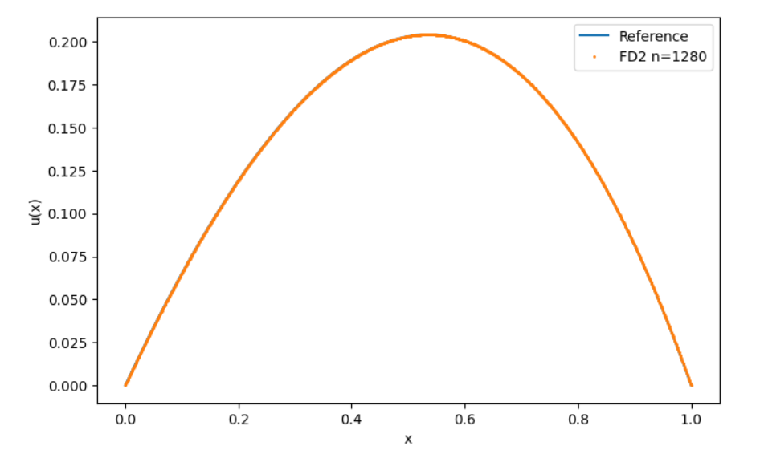

**Problem**

Consider the boundary value problem:

$$- u''(x) = e^{\sin x}, \quad 0 < x < 1, \quad u(0)=u(1)=0.$$

---

**Analytical Representation**

Using the Green’s function for the homogeneous Dirichlet problem on $$[0,1]:$$

$$
G(x,t)=
\begin{cases}
t(1-x), & 0 \le t \le x,\\
x(1-t), & x < t \le 1
\end{cases}
$$

the exact solution is

$$u(x)=\int_0^1 G(x,t)e^{\sin t}\,dt.$$

This is used to compute a high-accuracy reference solution through composite Gauss–Legendre quadrature.

<br></br>
**Numerical Methods**

* FD2 Scheme — Second-Order Accuracy
A standard centered finite-difference discretization:

$$
-\frac{u_{j-1}-2u_j+u_{j+1}}{h^2} = f(x_j), \quad u_0=u_n=0
$$

$$\quad$$ $$\quad$$ leads to a tridiagonal system $$A u = h^2 f$$ , where $$A$$ is symmetric and strictly diagonally dominant.

* FD4 Scheme — Fourth-Order Accuracy (Modified)
For higher accuracy, a 5-point stencil is used in the interior:

$$
-\frac{-u_{j-2}+16u_{j-1}-30u_j+16u_{j+1}-u_{j+2}}{12h^2} = f(x_j),
$$

$$\quad$$ $$\quad$$ and one-sided 4th-order formulas near the boundaries to eliminate dependence on ghost points:

$$
\begin{aligned}
-u''(x_1)&\approx (35u_0-104u_1+114u_2-56u_3+11u_4)/(12h^2),\\
-u''(x_{n-1})&\approx (-11u_{n-4}+56u_{n-3}-114u_{n-2}+104u_{n-1})/(12h^2).
\end{aligned}
$$

<br></br>
**Experiment**

* Reference Solution: Computed with composite Gauss–Legendre quadrature using 8 points per subinterval and 300 panels.  
* Grid Sizes: $$n = 20, 40, 80, 160, 320, 640, 1280 .$$  
* Error Metric: Maximum norm error, $$|u_h - u_{\text{ref}}\|_\infty.$$


<br></br>
**Results**
```python
# Plot convergence
    plt.figure(figsize=(8,5))
    if res2:
        # 繪製 FD2 誤差曲線
        plt.loglog([r[1] for r in res2], [r[2] for r in res2], '-o', label='FD2')
    if res4:
        # 繪製 FD4 誤差曲線
        plt.loglog([r[1] for r in res4], [r[2] for r in res4], '-s', label='FD4')
    plt.xlabel('h'); plt.ylabel('max error'); plt.gca().invert_xaxis()
    plt.grid(True, which='both', ls=':')
    plt.legend()
    plt.show()
```


<div align = "center">
  
  | Scheme | Order | Typical Rate | Smallest Error | Behavior |
  |:---:|:---:|:---:|:---:|:---:|
  | FD2 | $$2$$ | $$≈ 2.0$$ | $$~1e-7 to 1e-8$$ | Consistent second-order convergence |
  | FD4 | $$4$$ | $$3.5–4.0$$  | $$~1e-9$$ | Achieves higher accuracy before roundoff plateau |
</div>

The FD4 scheme shows faster convergence and lower absolute error until the error floor (~1e−9) due to roundoff.  

```pyhton
# Solution comparison (finest n)
    nfin = ns[-1]
    x_fd, u_fd = solve_fd2(nfin)
    plt.figure(figsize=(8,5))
    plt.plot(x_sample, u_ref, label='Reference')
    plt.plot(x_fd, u_fd, '.', ms=2, label=f'FD2 n={nfin}')
    plt.legend(); plt.xlabel('x'); plt.ylabel('u(x)')
    plt.show()
```



<br></br>

**Accuracy Limitation**

The total error can be modeled as

$$
E(h)\approx C_1 h^p + C_2 \varepsilon_{\text{mach}} h^{-q},
$$

where the first term represents truncation error (order $$p$$ ) and the second accounts for floating-point amplification due to the matrix condition number ($$\kappa(A)\sim h^{-2}$$ ).

Balancing these terms gives the optimal grid size $$h_{\text{opt}}\sim \varepsilon_{\text{mach}}^{1/(p+q)}.$$  
For double precision, $$h_{\text{opt}}\approx 10^{-4}$$ , corresponding to a minimal achievable error around $$10^{-8}.$$  


<br></br>

**Conclusion**

* The FD2 scheme converges as \(O(h^2)\), while FD4 improves the accuracy to nearly $$O(h^4).$$  
* Numerical precision limits the smallest achievable error to about $$10^{-8}.$$  
* Proper boundary treatment is critical for realizing high-order convergence in finite-difference schemes.

<br></br>
**Programing**
link:https://colab.research.google.com/drive/1JGj0miG1kUZu5jqyDBwI7XPNOj5Mt7hx?usp=sharing
