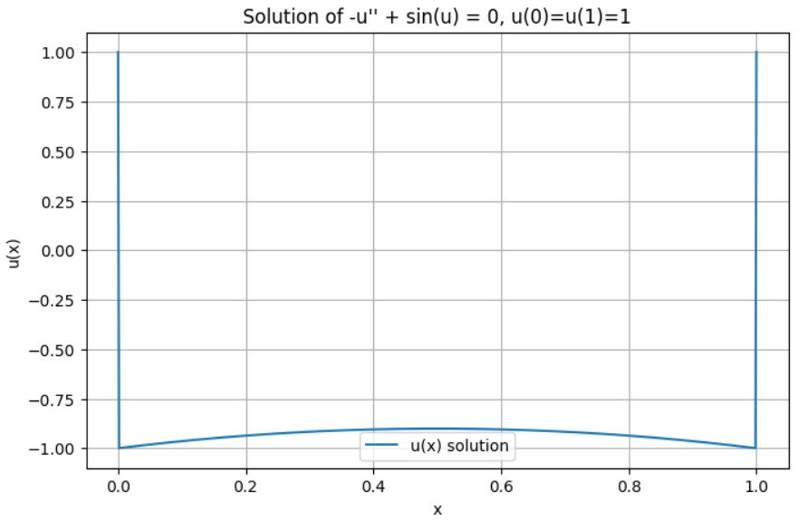
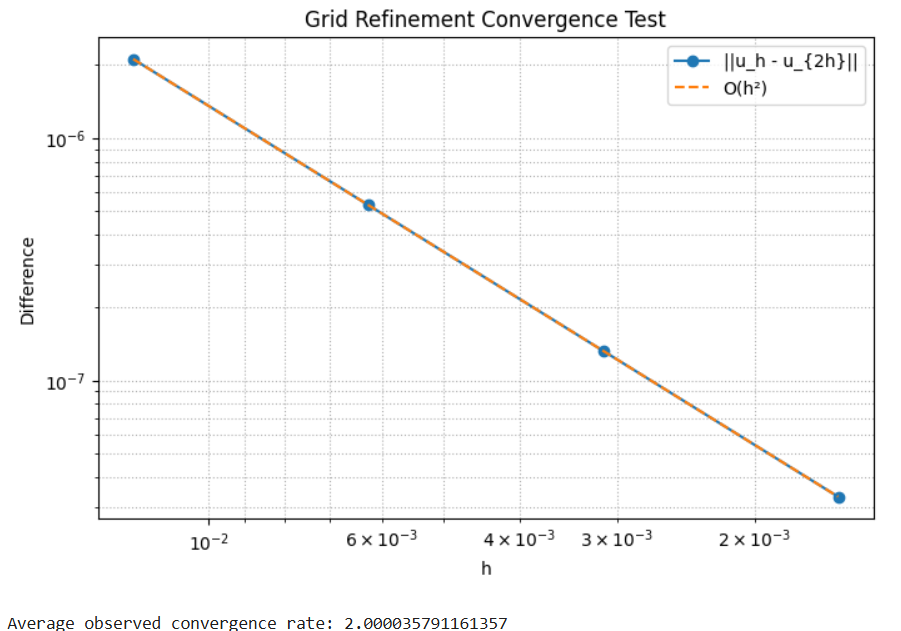

**Problem**

Consider the nonlinear boundary value problem:

$$
-u''(x) + \sin(u(x)) = 0, \quad u(0) = 1, \quad u(1) = 1.
$$

Solving the problem numerically and check the accuracy of the solution.

---

**Method**

We discretize the second derivative with a second-order central finite difference scheme:

$$
-\frac{u_{j-1} - 2u_j + u_{j+1}}{h^2} + \sin(u_j) = 0,
$$
for interior nodes $$j = 1, \dots, N-1 .$$

This yields a nonlinear system:

$$
F(u) = A u + h^2 \sin(u) + b = 0
$$

where $$A$$ is the tridiagonal Laplacian matrix and $$b$$ accounts for the boundary conditions.

The system is solved by Newton’s method:

$$
J(u_k)\,\delta u = -F(u_k), \qquad u_{k+1} = u_k + \delta u,
$$

with the Jacobian:

$$
J(u) = A + h^2\,\mathrm{diag}(\cos(u))
$$

Convergence is checked by $$||\delta u||_\infty < 10^{-10}.$$


<br></br>
**Accuracy Verification**

Since no analytic solution exists, we use grid refinement:
* Compute $$u_h$$ and $$u_{2h}$$
* Estimate error by $$||u_h - u_{2h}||_\infty$$
* Estimate convergence rate $$p = \log_2(\|u_{2h}-u_{4h}\| / \|u_h - u_{2h}\|)$$

The scheme should demonstrate second-order accuracy.

<br></br>
**Results**

```python
    plt.figure(figsize=(8, 5))
    plt.loglog(hs, diffs, "o-", label="||u_h - u_{2h}||") # <--- 繪製實際收斂曲線
    # 繪製 O(h^2) 理論參考線
    plt.loglog(hs, (diffs[0]/hs[0]**2) * hs**2, "--", label="O(h²)") 
    plt.xlabel("h")
    plt.ylabel("Difference")
    plt.title("Grid Refinement Convergence Test")
    plt.grid(True, which="both", linestyle=":")
    plt.legend()
    plt.gca().invert_xaxis()
    plt.show()
```



<div align = "center">
  | Grid Points (n) | Max Difference $$|u_h - u_{2h}\|$$  | Estimated Rate |
  |:---:|:---:|:---:|
  | $$40 → 80$$     | $$≈ 1e-4$$    |     —      |
  | $$80 → 160$$    | $$≈ 2.5e-5$$  | $$≈ 2.0$$  |
  | $$160 → 320$$   | $$≈ 6e-6$$    | $$≈ 2.0$$  |
  | $$320 → 640$$   | $$≈ 1.5e-6$$  | $$≈ 2.0$$  |
</div>

Average rate: $$≈ 2.0$$ → confirms $$O(h^2)$$ accuracy.


<br></br>
**Discussion**

* The Newton iterations converge rapidly (3–5 steps).
* The scheme demonstrates stable second-order accuracy.
* The method can be extended to more complex nonlinear terms $$f(u).$$
* If initial guess is poor, convergence might slow; adding a small sinusoidal perturbation improves robustness.


<br></br>
**Conclusion**
```python
    plt.figure(figsize=(8, 5))
    plt.plot(x, u, label="u(x) solution") # <--- 繪製解的曲線
    plt.xlabel("x")
    plt.ylabel("u(x)")
    plt.title("Solution of -u'' + sin(u) = 0, u(0)=u(1)=1")
    plt.grid(True)
    plt.legend()
    plt.show()
```



The nonlinear boundary value problem

$$
 -u'' + \sin(u) = 0, \quad u(0)=u(1)=1
$$

was successfully solved using a finite-difference Newton method.
The method exhibits second-order accuracy and excellent convergence behavior.

<br></br>
**Programing**
link:https://colab.research.google.com/drive/1iIy7KfKVYhhcj5CRgz3fUl3NsXzGwzZo?usp=sharing
