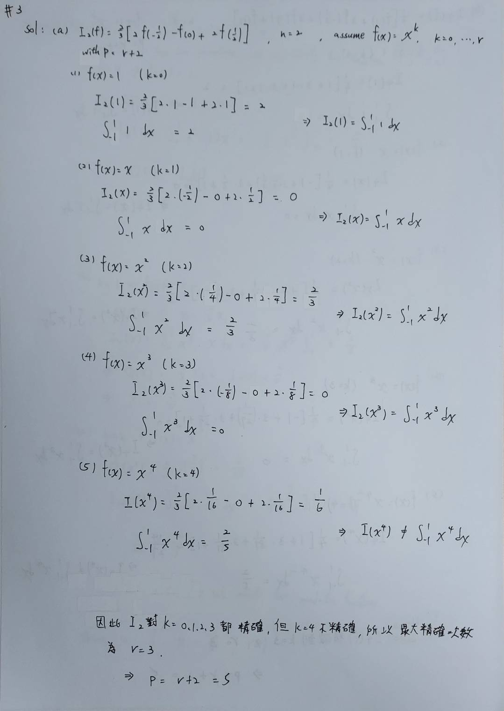
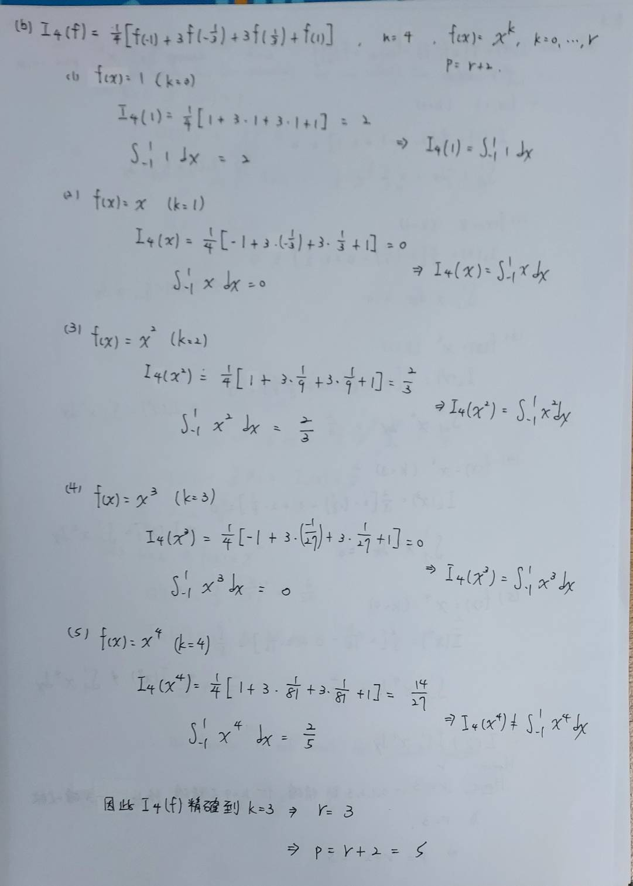

3. Let $$I_n(f) = \sum_{k=0}^{n} \alpha_k f(x_k)$$ be a Lagrange quadrature formula on $$n+1$$ nodes.
Compute the degree of exactness $$r$$ of the formulae:

    (a) $$I_2(f) = (2/3)[2f(-1/2) - f(0) + 2f(1/2)]$$,

    (b) $$I_4(f) = (1/4)[f(-1) + 3f(-1/3) + 3f(1/3) + f(1)]$$.

    Which is the order of infinitesimal $$p$$ for (a) and (b)?

    [Solution: $r=3$ and $p=5$ for both $I_2(f)$ and $I_4(f)$.]
---

