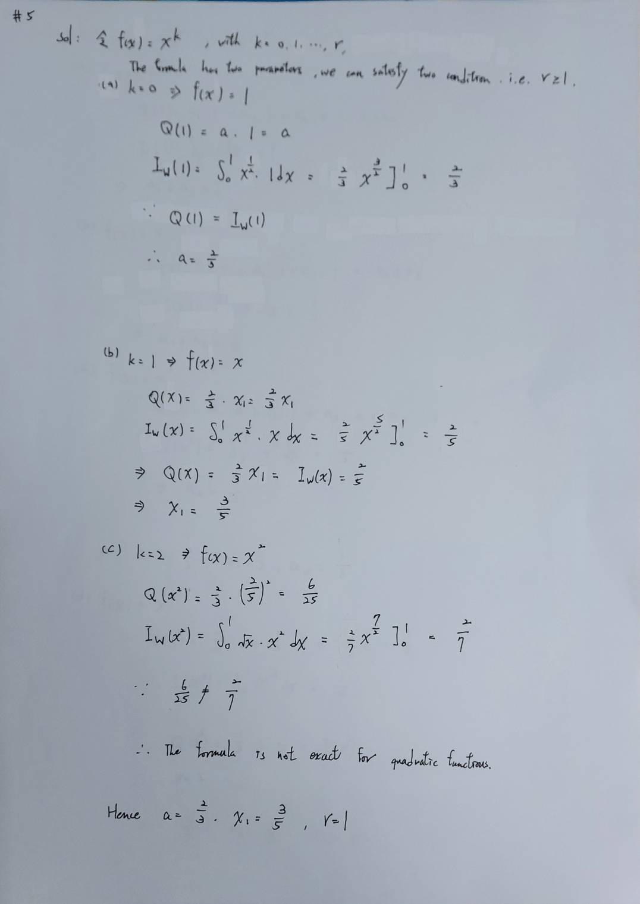

Let $$I_w(f) = \int_0^1 w(x)f(x)dx$$ with $$w(x) = \sqrt{x}$$, and consider the quadrature formula $$Q(f) = a f(x_1)$$.

Find $$a$$ and $x_1$ in such a way that $$Q$$ has maximum degree of exactness $$r$$.

[Solution: $a=2/3$, $x_1=3/5$ and $r=1$.]

---

