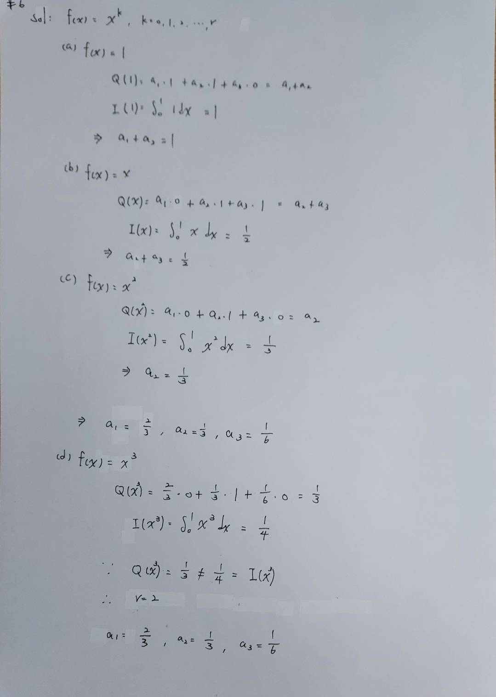

Let us consider the quadrature formula $$Q(f) = \alpha_1 f(0) + \alpha_2 f(1) + \alpha_3 f'(0)$$ for the approximation of $$I(f) = \int_0^1 f(x)dx$$ , where $$f \in C^1([0,1]).$$

Determine the coefficients $$\alpha_j$$, for $$j=1, 2, 3$$ in such a way that $$Q$$ has degree of exactness $$r=2.$$

[Solution: $\alpha_1=2/3$, $\alpha_2=1/3$ and $\alpha_3=1/6$.]

