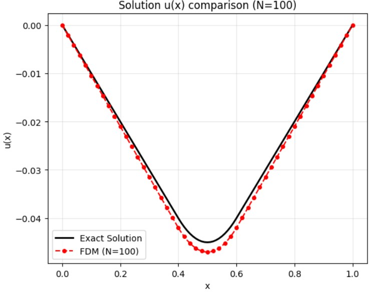
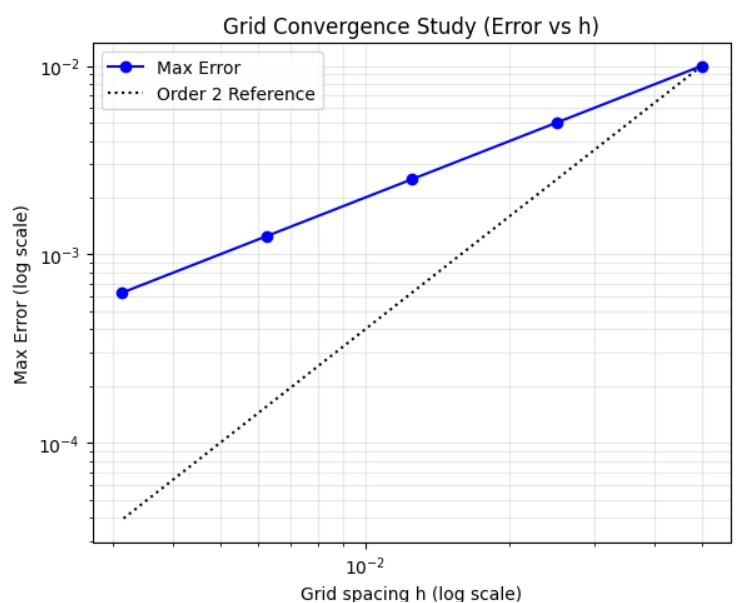
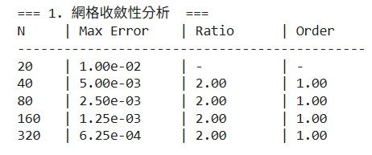
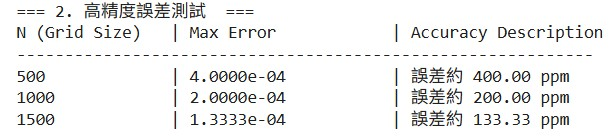

Consider the boundary value problem

$$u'' = f, \quad u(0)=0, \quad u(1)=0,$$

where

$$
f(x)=\begin{cases} 1 \quad 0.4\le x\le 0.6,\\
0 \quad \text{otherwise}.
\end{cases}
$$

* Find the exact solution of this problem.<br></br>
* Solve the problem using finite difference method and check the accuracy of your solutions.

<br></br>
<br></br>

微分方程的邊界值問題 BVP 以及數值分析中的有限差分法 FDM


```python
def exact_solution(x_arr):
    u_exact = np.zeros_like(x_arr)
    for i, x in enumerate(x_arr):
        if 0 <= x < 0.4:
            u_exact[i] = -0.1 * x
        elif 0.4 <= x <= 0.6:
            u_exact[i] = 0.5 * x**2 - 0.5 * x + 0.08
        else:
            u_exact[i] = 0.1 * (x - 1)
    return u_exact

def solve_fdm(N):

    h = 1.0 / N
    x = np.linspace(0, 1, N+1)
    f = np.zeros(N-1)
    x_interior = x[1:-1]

    for i, xi in enumerate(x_interior):
        if (xi > 0.4 or np.isclose(xi, 0.4)) and (xi < 0.6 or np.isclose(xi, 0.6)):
            f[i] = 1.0
        else:
            f[i] = 0.0
            

    dim = N - 1 
    A = np.zeros((dim, dim))
    b = - (h**2) * f
    
    for i in range(dim):
        A[i, i] = 2.0
        if i > 0:
            A[i, i-1] = -1.0
        if i < dim - 1:
            A[i, i+1] = -1.0
            

    u_interior = np.linalg.solve(A, b)
    u_sol = np.concatenate(([0], u_interior, [0]))
    
    return x, u_sol


if __name__ == "__main__":
    grid_sizes, errors = run_convergence_study()
    run_high_precision_test()
    N_plot = 100
    x_plot, u_plot = solve_fdm(N_plot)
    u_exact_plot = exact_solution(x_plot)
    plt.figure(figsize=(12, 5))
    plt.subplot(1, 2, 1)
    plt.plot(x_plot, u_exact_plot, 'k-', linewidth=2, label='Exact Solution')
    plt.plot(x_plot, u_plot, 'r--', marker='o', markersize=4, markevery=2, label=f'FDM (N={N_plot})')
    plt.title(f'Solution u(x) comparison (N={N_plot})')
    plt.xlabel('x')
    plt.ylabel('u(x)')
    plt.grid(True, alpha=0.3)
    plt.legend()
    plt.subplot(1, 2, 2)
    h_vals = [1/n for n in grid_sizes]
    plt.loglog(h_vals, errors, 'bo-', label='Max Error')
    plt.loglog(h_vals, [errors[0]*(h/h_vals[0])**2 for h in h_vals], 'k:', label='Order 2 Reference')
    plt.title('Grid Convergence Study (Error vs h)')
    plt.xlabel('Grid spacing h (log scale)')
    plt.ylabel('Max Error (log scale)')
    plt.grid(True, which="both", alpha=0.3)
    plt.legend()
    plt.tight_layout()
    plt.show()
```


<table>
  <tr>
    <td>
      
    </td>
    <td>
      <p>網格數 N = 100 的情況下</p>
      <p>X 軸：範圍從 0 到 1。</p>
      <p>Y 軸：表示 u(x) 在各位置的值。</p>
      <p>黑色實線（Exact Solution）<br>
         ‧ 精確解。<br>
         ‧ 曲線在 x ≈ 0.5 附近達到極小值（約 -0.045）。</p>
      <p>紅色虛線帶點（FDM Numerical）<br>
         ‧ 數值近似解。<br>
         ‧ 每個紅點代表一個網格點。<br>
         ‧ 與精確解有些微誤差，可透過增加 N 減少。</p>
    </td>
  </tr>
</table>


<br></br>

<table>
  <tr>
    <td>
      
    </td>
    <td>
      <p>驗證算法準確性，當網格變得越來越密（步長 $$h$$ 變小）時，計算誤差是如何下降的。</p>
      <p>X 軸 (Grid spacing h)：代表網格間距（步長）。數值越往左，代表 $h$ 越小（網格越密，計算量越大）。</p>
      <p>Y 軸 (Max Error)： 代表數值解與精確解之間的最大誤差 ($$\max|u_{num} - u_{exact}|$$)</p>
      <p>藍色實線帶點 (Max Error)<br>
         ‧ 實際測量的誤差數據點。<br>
         ‧ 隨著 $h$ 變小，誤差呈現直線下降趨勢。</p>
      <p>黑色虛線 (Order 2 Reference)<br>
         ‧ 為一條參考線，其斜率代表二階收斂 ($$O(h^2)$$)。<br>
         ‧  若藍色線與黑色虛線平行，則證明該算法具有二階精度。<br>
    </td>
  </tr>
</table>

<br></br>

```python
def run_convergence_study():
    print("\n=== 1. 網格收斂性分析  ===")
    print(f"{'N':<5} | {'Max Error':<12} | {'Ratio':<10} | {'Order':<10}")
    print("-" * 45)
    
    grid_sizes = [20, 40, 80, 160, 320]
    errors = []
    
    for N in grid_sizes:
        x, u_fdm = solve_fdm(N)
        u_true = exact_solution(x)
        max_err = np.max(np.abs(u_fdm - u_true))
        errors.append(max_err)
        
        if len(errors) > 1:
            ratio = errors[-2] / errors[-1]
            order = np.log2(ratio)
            print(f"{N:<5} | {max_err:.2e}     | {ratio:.2f}       | {order:.2f}")
        else:
            print(f"{N:<5} | {max_err:.2e}     | {'-':<10} | {'-':<10}")
            
    return grid_sizes, errors


def run_high_precision_test():
    target_Ns = [500, 1000, 1500]

    print("\n=== 2. 高精度誤差測試  ===")
    print(f"{'N (Grid Size)':<15} | {'Max Error':<20} | {'Accuracy Description'}")
    print("-" * 60)

    for N in target_Ns:
        x, u_fdm = solve_fdm(N)
        u_true = exact_solution(x)
        error = np.max(np.abs(u_fdm - u_true))
        
        print(f"{N:<15} | {error:.4e}           | 誤差約 {error*1000000:.2f} ppm")
```

<br></br>

<table>
  <tr>
    <td>
      
    </td>
    <td>
      
    </td>
  </tr>
</table>


<br></br>
**分析與結論：**
平行性：藍色實線與黑色虛線幾乎完全平行。
收斂率：這意味著當網格間距 $$h$$ 減半時，誤差會縮小為原來的 $$1/4$$。

<br></br>

**Programing**

link:https://colab.research.google.com/drive/1g4BV6GIuQ-2QT-OIAsdj49ySwK3KpUOI?usp=sharing
