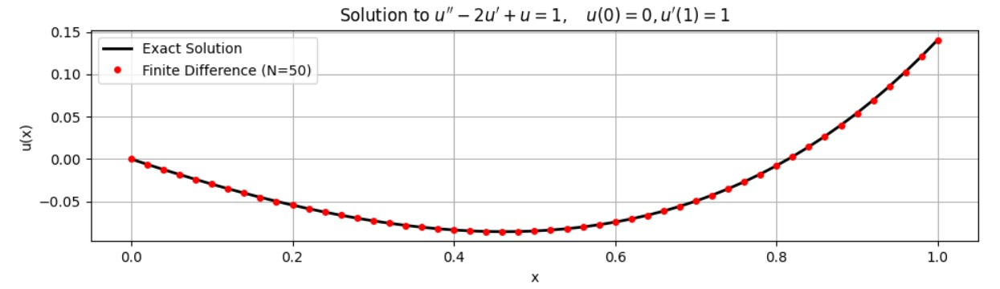
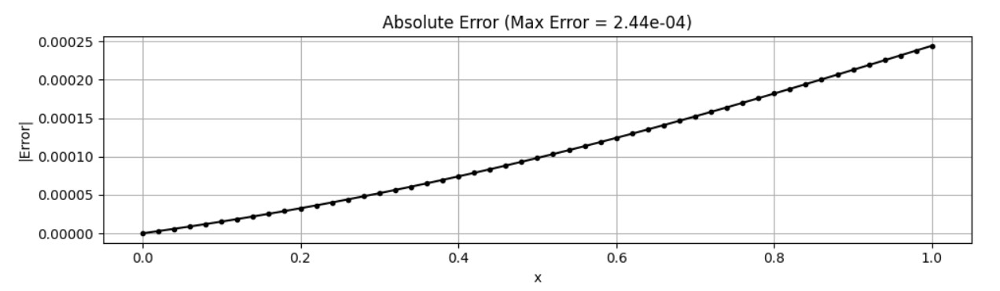

Consider the boundary value problem:

$$u'' - 2u' + u = 1, \quad u(0)=0, \quad u'(1)=1.$$

* Show that the solution is unique by considering the homogeneous problem.
* Develop a 2nd-order finite difference method.
* Solve the problem and check the accuracy of your solutions.

<br></br>

**Sol:**

**證明唯一性**

$$
v'' - 2v' + v = 0,\qquad v(0)=0,\; v'(1)=0
$$

特徵方程：

$$
r^2 - 2r + 1 = 0 = (r-1)^2
$$

故重根：

$$
r=1
$$

齊次通解：

$$
v(x)=c_1 e^x + c_2 x e^x
$$

由 \(v(0)=0\)：

$$
c_1 = 0
$$

於是

$$
v(x)=c_2 x e^x
$$

計算導數：

$$
v'(x)=c_2(e^x + x e^x)=c_2 e^x(1+x)
$$

由 \(v'(1)=0\)：

$$
0 = v'(1) = c_2 e^1(1+1) = 2e\ c_2
$$

因此

$$
c_2 = 0
$$

得

$$
c_1=c_2=0 \quad\Rightarrow\quad v(x)\equiv 0
$$

既然 $$c_1=0$$ 且 $$c_2=0$$ ，則齊次問題則為trivial solution ，也就是 $$v(x) \equiv 0$$ 。因齊次問題只有零解，則原非齊次問題存在唯一解(線性微分方程理論)。

<br></br>

**二階有限差分法**


將區間 $$[0, 1]$$ 分割為 $$N$$ 等份，步長 $$h = 1/N$$ 。
定義網格節點為 $$x_i = i \cdot h$$ ，其中 $$i = 0, 1, \dots, N$$ 。

使用 Central Differencen 近似一階與二階導數：

$$u''_i \approx \frac{u_{i+1} - 2u_i + u_{i-1}}{h^2}, \quad u'_i \approx \frac{u_{i+1} - u_{i-1}}{2h}$$


代入原微分方程式 $$u'' - 2u' + u = 1$$ ：

$$\frac{u_{i+1} - 2u_i + u_{i-1}}{h^2} - 2\left(\frac{u_{i+1} - u_{i-1}}{2h}\right) + u_i = 1$$

全式同乘 $$h^2$$ 並整理係數：

$$(u_{i+1} - 2u_i + u_{i-1}) - h(u_{i+1} - u_{i-1}) + h^2 u_i = h^2$$

合併同類項 ($u_{i-1}, u_i, u_{i+1}$)：

$$u_{i-1}(1+h) + u_i(h^2 - 2) + u_{i+1}(1-h) = h^2$$


假設在 $x=1$ 右側存在一個虛擬點 $u_{N+1}$。
利用中心差分表示邊界導數條件：

$$\frac{u_{N+1} - u_{N-1}}{2h} = 1 \implies u_{N+1} = u_{N-1} + 2h$$

將 $u_{N+1}$ 代入 $i=N$ 時的通用差分方程式：

$$u_{N-1}(1+h) + u_N(h^2 - 2) + u_{N+1}(1-h) = h^2$$

消去 $u_{N+1}$：

$$u_{N-1}(1+h) + u_N(h^2 - 2) + (u_{N-1} + 2h)(1-h) = h^2$$

展開並整理：
    
$$u_{N-1}(1+h) + u_N(h^2 - 2) + u_{N-1}(1-h) + 2h(1-h) = h^2$$
    
$$u_{N-1}(1+h+1-h) + u_N(h^2 - 2) + 2h - 2h^2 = h^2$$
    
$$2u_{N-1} + (h^2 - 2)u_N = h^2 - (2h - 2h^2)$$

第 $N$ 點的方程式：
$$2 u_{N-1} + (h^2 - 2) u_N = 3h^2 - 2h$$

<br></br>
```python
plt.subplot(2, 1, 1)
plt.plot(x_num, u_exact, 'k-', linewidth=2, label='Exact Solution')
plt.plot(x_num, u_num, 'ro', markersize=4, label='Finite Difference (N={})'.format(N))
plt.title(r"Solution to $u'' - 2u' + u = 1, \quad u(0)=0, u'(1)=1$")
plt.xlabel('x')
plt.ylabel('u(x)')
plt.legend()
plt.grid(True)
```


* 黑速實線 (Exact Solution)：代表問題的數學解析解 $$u(x) = -e^x + \frac{1+e}{2e}xe^x + 1$$。
* 紅色圓點 (Finite Difference)：代表數值方法的計算結果。
* 觀察：紅點緊密落在黑線上，顯示數值解非常接近真實解。

```python

plt.subplot(2, 1, 2)
plt.plot(x_num, error, 'k.-')
plt.title(f'Absolute Error (Max Error = {max_error:.2e})')
plt.xlabel('x')
plt.ylabel('|Error|')
plt.grid(True)

plt.tight_layout()
plt.show()
```



* 該圖顯示了絕對誤差 $$|u_{num} - u_{exact}|$$ 隨 $$x$$ 的變化。
* 當 $$N=50$$ 時，最大誤差大約落在 $$10^{-5}$$ 到 $$10^{-4}$$ 的數量級。
* 若將 $$N$$ 加倍，誤差理論上應縮小為原來的 $$1/4$$。

<br></br>
```python
print("\n--- Convergence Test ---")
print(f"{'N':<10} {'Max Error':<15} {'Ratio (Error_old/Error_new)':<25}")

prev_error = None
for n_test in [50, 100, 200, 400]:
    x_t, u_t = solve_bvp_finite_difference(n_test)
    u_ex = exact_solution(x_t)
    curr_error = np.max(np.abs(u_t - u_ex))
    
    ratio_str = "-"
    if prev_error is not None:
        ratio = prev_error / curr_error
        ratio_str = f"{ratio:.2f}"
    
    print(f"{n_test:<10} {curr_error:.2e}       {ratio_str:<25}")
    prev_error = curr_error
```


**Programing**

link:https://colab.research.google.com/drive/1sG8rGSASYlNqRKywv4MKQV6t5s7pim2r?usp=sharing
