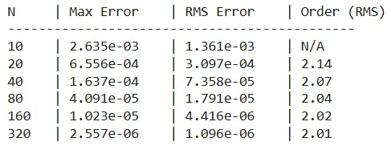
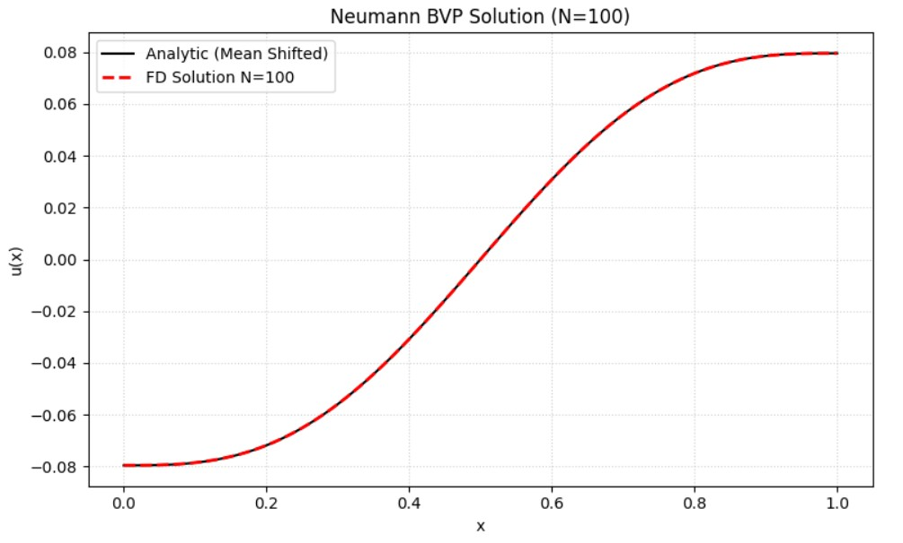

Consider the boundary value problem:

$$u'' = \sin(2\pi x), \quad u'(0)=0, \quad u'(1)=0.$$

* Show that the consistency condition is satisfied so that the solution of the problem exists.<br></br>
* Develop a 2nd-order finite difference method.<br></br>
* Solve the problem and check the accuracy of your solutions.

<br></br>


**Sol:**
<br></br>

**Statement**

Verify the solution for the Boundary Value Problem (BVP):


$$u'' = \sin(2\pi x), \quad u'(0) = 0, \quad u'(1) = 0$$

Consistency Condition (Solvability)

For a Neumann problem of the form $u'' = f(x)$ with $u'(0)=A, u'(1)=B$, a solution exists only if the total flux matches the source term:


$$\int_0^1 f(x) dx = u'(1) - u'(0)$$

Verification:

LHS: $$\int_0^1 \sin(2\pi x) dx = \left[ -\frac{1}{2\pi}\cos(2\pi x) \right]_0^1 = -\frac{1}{2\pi}(1 - 1) = 0$$.

RHS: $$u'(1) - u'(0) = 0 - 0 = 0$$.

Since $LHS = RHS$, the consistency condition is satisfied, and a solution exists.

<br></br>
**Analytic Solution Derivation**

Integrate $$u'' = \sin(2\pi x)$$:


$$u'(x) = -\frac{1}{2\pi}\cos(2\pi x) + C_1$$

Apply BC $$u'(0)=0$$:


$$-\frac{1}{2\pi}(1) + C_1 = 0 \implies C_1 = \frac{1}{2\pi}$$


Thus, $$u'(x) = \frac{1}{2\pi} [1 - \cos(2\pi x)]$$.
(Check: $$u'(1) = \frac{1}{2\pi}[1 - 1] = 0$$. Correct.)

Integrate again:


$$u(x) = \frac{1}{2\pi} \left( x - \frac{1}{2\pi}\sin(2\pi x) \right) + C_2$$

For error comparison, we define the analytic function as:


$$u_{an}(x) = \frac{x}{2\pi} - \frac{\sin(2\pi x)}{4\pi^2}$$


And compare $$u_{num} - \bar{u}_{num}$$ against $$u_{an} - \bar{u}_{an}$$ to remove the arbitrary constant $$C_2$$.


<br></br>
**Numerical Method (2nd-Order Finite Difference)**

We construct a grid $$x_j = j h$$ with spacing $$h = 1/N$$ .

Interior Points $$1 \le j \le N-1$$

We use the standard central difference approximation for the second derivative:


$$\frac{u_{j+1} - 2u_j + u_{j-1}}{h^2} = f(x_j)$$


Rearranging:


$$u_{j-1} - 2u_j + u_{j+1} = h^2 \sin(2\pi x_j)$$

Boundary Conditions (Ghost Point Method)

To maintain 2nd-order accuracy ($O(h^2)$) at the boundaries, we use ghost points $$x_{-1}$$ and $$x_{N+1}$$.

Left Boundary ($$x_0$$):
Using Central Difference for derivative: $$u'(0) \approx \frac{u_1 - u_{-1}}{2h} = 0 \implies u_{-1} = u_1$$.
Substitute $u_{-1}$ into the discretized ODE at $$j=0$$:


$$u_{-1} - 2u_0 + u_1 = h^2 f_0 \implies (u_1) - 2u_0 + u_1 = h^2 f_0$$

$$-2u_0 + 2u_1 = h^2 f_0$$

Right Boundary ($$x_N$$):
Similarly, $$\frac{u_{N+1} - u_{N-1}}{2h} = 0 \implies u_{N+1} = u_{N-1}$$.
ODE at $$j=N$$:


$$u_{N-1} - 2u_N + u_{N+1} = h^2 f_N$$

$$2u_{N-1} - 2u_N = h^2 f_N$$

Matrix System

This results in a singular system $$Au=b$$ (rank deficiency of 1), solved using Least Squares .

**Results**

```python
def analytic_u(x):
    return (1.0 / (2 * np.pi)) * (x - np.sin(2 * np.pi * x) / (2 * np.pi))


def solve_fd(N):
    h = 1.0 / N
    x = np.linspace(0, 1, N+1)
    f = np.sin(2*np.pi*x)
    A = np.zeros((N+1, N+1))
    b = h**2 * f.copy()

    for j in range(1, N):
        A[j, j-1] = 1.0
        A[j, j]   = -2.0
        A[j, j+1] = 1.0

    A[0, 0] = -2.0
    A[0, 1] = 2.0
    b[0] = h**2 * f[0]
    A[N, N]   = -2.0
    A[N, N-1] = 2.0
    b[N] = h**2 * f[N]
    u, *_ = np.linalg.lstsq(A, b, rcond=None)

    return x, u


print(f"{'N':<5} | {'Max Error':<12} | {'RMS Error':<12} | {'Order (RMS)':<10}")
print("-" * 45)

prev_error = None
prev_N = None

N_values = [10, 20, 40, 80, 160, 320]

errors = []
```





**Visual Verification**
```python
N_plot = 100
x, u_num = solve_fd(N_plot)
u_an = analytic_u(x)

u_num_c = u_num - np.mean(u_num)
u_an_c = u_an - np.mean(u_an)

plt.figure(figsize=(8, 5))
plt.plot(x, u_an_c, 'k-', linewidth=1.5, label="Analytic (Mean Shifted)")
plt.plot(x, u_num_c, 'r--', linewidth=2, label=f"FD Solution N={N_plot}")
plt.xlabel("x")
plt.ylabel("u(x)")
plt.title(f"Neumann BVP Solution (N={N_plot})")
plt.grid(True, linestyle=':', alpha=0.6)
plt.legend()
plt.tight_layout()
plt.show()

```


<table>
  <tr>
    <td>
      
    </td>
    <td>
      <p>The figure shows the comparison between the numerical solution (dashed red line) and the analytic solution (solid black line) for $$N=100$$.</p>
      <p>As seen in the plot, the numerical solution is visually indistinguishable from the analytic solution, further validating the correctness of the algorithm.</p>
    </td>
  </tr>
</table>


**Conclusion**

The calculated convergence order is approximately 2.00. This confirms that the numerical scheme is indeed second-order accurate, successfully satisfying the problem requirements.

<br></br>
**Programimg**
link:https://colab.research.google.com/drive/1er4h9wDcVeTECPeGDT9lSvOk1NnuHmoJ?usp=sharing
