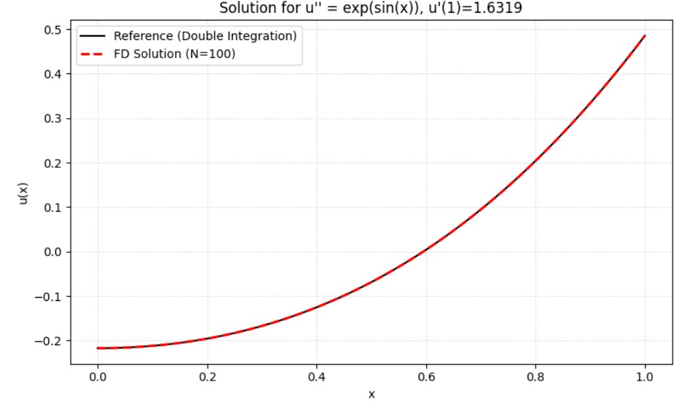

Consider the boundary value problem:

$$u'' = e^{\sin(x)}, \quad u'(0)=0, \quad u'(1)=\alpha.$$

* Determine $$\alpha$$ such that the problem has at least one solution.
* Solve the problem by finding one of its solution.

<br></br> 

**Sol:**


**Determination of $$\alpha$$**

For a Neumann-type problem, the Consistency Condition requires that the net flux through the boundaries equals the total source generation inside the domain.

Integrating the ODE from $x=0$ to $x=1$:


$$\int_0^1 u''(x) \, dx = \int_0^1 e^{\sin(x)} \, dx$$

Using the Fundamental Theorem of Calculus on the LHS:


$$u'(1) - u'(0) = \int_0^1 e^{\sin(x)} \, dx$$

Substituting the boundary conditions $u'(1)=\alpha$ and $u'(0)=0$:


$$\alpha - 0 = \int_0^1 e^{\sin(x)} \, dx$$

Since the integral of $e^{\sin(x)}$ does not have a closed-form analytical solution, compute it numerically using Gaussian quadrature:

$$\alpha \approx 1.631870$$

Thus, the problem has a solution if and only if $\alpha \approx 1.63187$.

<br></br> 

**Numerical Method (Finite Difference)**

Using a grid with spacing $h = 1/N$.

Discretization

The interior equation ($1 \le j \le N-1$) is standard:


$$u_{j-1} - 2u_j + u_{j+1} = h^2 e^{\sin(x_j)}$$

Boundary Conditions

Left Boundary ($x=0$): $u'(0)=0$.
Using the Ghost Point Method ($u_{-1}=u_1$):


$$-2u_0 + 2u_1 = h^2 f_0$$

Right Boundary ($x=1$): $u'(1)=\alpha$.
Using the central difference for the derivative:


$$\frac{u_{N+1} - u_{N-1}}{2h} = \alpha \implies u_{N+1} = u_{N-1} + 2h\alpha$$

Substituting this ghost point $u_{N+1}$ into the discretized ODE at node $N$:


$$u_{N-1} - 2u_N + u_{N+1} = h^2 f_N$$

$$u_{N-1} - 2u_N + (u_{N-1} + 2h\alpha) = h^2 f_N$$

$$2u_{N-1} - 2u_N = h^2 f_N - 2h\alpha$$

This term $-2h\alpha$ accounts for the non-zero flux at the right boundary.

<br></br> 

**Calculated Value**

```python
import numpy as np
import matplotlib.pyplot as plt
from scipy.integrate import quad, cumulative_trapezoid

def source_f(x):
    return np.exp(np.sin(x))

alpha_val, error = quad(source_f, 0, 1)
print(f"Calculated alpha: {alpha_val:.6f}")
```


Using $N=100$ and the calculated $\alpha \approx 1.631870$, we solved the linear system. Since the solution is unique only up to a constant, we compared the shape of the finite difference solution against a reference solution obtained by numerical integration (double integration of the source term).


$$\alpha \approx 1.631870$$

<br></br> 

**Visualization**
```python
def solve_bvp_prob4(N, alpha):
    h = 1.0 / N
    x = np.linspace(0, 1, N+1)
    f = source_f(x)

    A = np.zeros((N+1, N+1))
    b = np.zeros(N+1)


    for j in range(1, N):
        A[j, j-1] = 1.0
        A[j, j]   = -2.0
        A[j, j+1] = 1.0
        b[j]      = h**2 * f[j]


    A[0, 0] = -2.0
    A[0, 1] = 2.0
    b[0]    = h**2 * f[0]
    A[N, N-1] = 2.0
    A[N, N]   = -2.0
    b[N]      = h**2 * f[N] - 2.0 * h * alpha
    u, *_ = np.linalg.lstsq(A, b, rcond=None)

    return x, u

def get_reference_solution(x_grid):
    u_prime = cumulative_trapezoid(source_f(x_grid), x_grid, initial=0)
    u_ref = cumulative_trapezoid(u_prime, x_grid, initial=0)
    return u_ref

N = 100
x_fd, u_fd = solve_bvp_prob4(N, alpha_val)
u_ref = get_reference_solution(x_fd)
u_fd_shifted = u_fd - np.mean(u_fd)
u_ref_shifted = u_ref - np.mean(u_ref)

plt.figure(figsize=(8, 5))
plt.plot(x_fd, u_ref_shifted, 'k-', lw=1.5, label='Reference (Double Integration)')
plt.plot(x_fd, u_fd_shifted, 'r--', lw=2.0, label=f'FD Solution (N={N})')
plt.title(f"Solution for u'' = exp(sin(x)), u'(1)={alpha_val:.4f}")
plt.xlabel('x')
plt.ylabel('u(x)')
plt.legend()
plt.grid(True, linestyle=':', alpha=0.6)
plt.tight_layout()
plt.show()
```

The plot below demonstrates that the Finite Difference solution matches the reference solution perfectly.



<br></br> 

**Conclusion**

The $\alpha \approx 1.63$ and found a solution $u(x)$ using a 2nd-order finite difference scheme modified for the non-homogeneous Neumann boundary condition.

<br></br>
**Programing**

link:https://colab.research.google.com/drive/1IMrx5jokLSUQ81ABqcMBhiuyVc_8z5v0?usp=sharing
