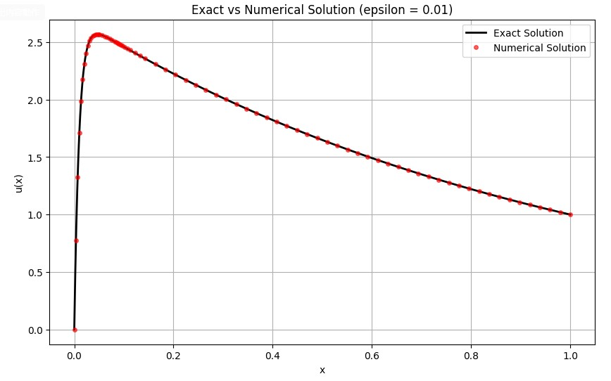
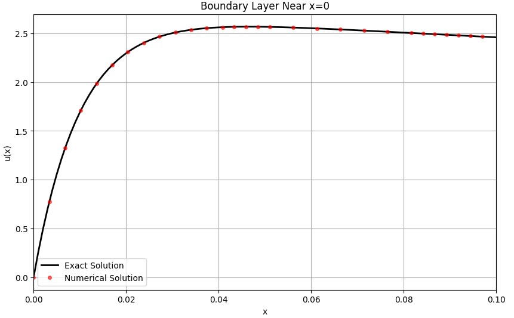
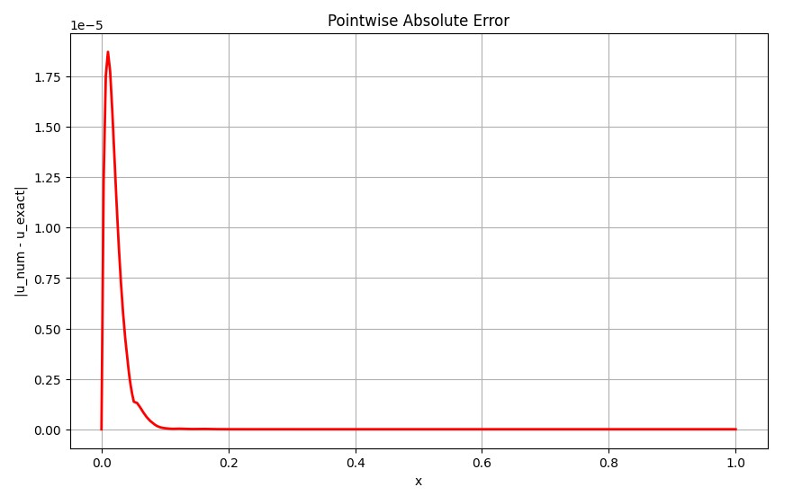

Consider the linear boundary value problem:

$$\epsilon u'' + (1+\epsilon) u' + u = 0, \quad u(0)=0, \quad u(1)=1.$$

Solve the problem and check the accuracy of your solutions. Choose $$\epsilon=0.01.$$

<br></br>

**Sol**
<br></br>

**Analytical Solution**

$$
\epsilon u'' + (1+\epsilon)u' + u = 0,\qquad 
u(0)=0,\;\; u(1)=1
$$

$$
\epsilon r^2 + (1+\epsilon)r + 1 = 0
$$
$$
(\epsilon r + 1)(r+1)=0
$$
$$
r_1=-1,\qquad r_2=-\frac{1}{\epsilon}
$$


$$
u(x)=c_1 e^{-x}+c_2 e^{-x/\epsilon}
$$


$$
u(0)=0:\quad c_1+c_2=0 \Rightarrow c_2=-c_1
$$
$$
u(1)=1:\quad c_1(e^{-1}-e^{-1/\epsilon})=1
$$
$$
c_1=\frac{1}{e^{-1}-e^{-1/\epsilon}},\qquad
c_2=-\frac{1}{e^{-1}-e^{-1/\epsilon}}
$$

$$
u(x)=\frac{e^{-x}-e^{-x/\epsilon}}{e^{-1}-e^{-1/\epsilon}}
$$

<br></br>
**Visualization**

<br></br>

**Exact Solution vs Numerical Solution**

```python
plt.figure(figsize=(10, 6))
plt.plot(x_plot, u_exact, 'k-', linewidth=2, label='Exact Solution')
plt.plot(x_sol, u_sol, 'ro', markersize=4, alpha=0.6, label='Numerical Solution')
plt.title(f'Exact vs Numerical Solution (epsilon = {epsilon})')
plt.xlabel('x'); plt.ylabel('u(x)')
plt.grid(True); plt.legend()
plt.show()
```
<table>
  <tr>
    <td style="vertical-align: top; padding-right: 20px;">
      
    </td>
    <td style="vertical-align: top;">
      <p>This figure compares the analytical solution:</p>
      <p>$$u(x)=\frac{e^{-x}-e^{-x/\epsilon}}{e^{-1}-e^{-1/\epsilon}}$$</p>
      <p>with the numerical solution for $$\epsilon = 0.01$$.</p>
      <ul>
        <li>A sharp boundary layer appears near $$x=0$$ due to the term $$e^{-x/\epsilon}$$ .</li>
        <li>After the boundary layer (roughly $$x>0.1$$) , the solution becomes smooth, dominated by $$e^{-x}$$ .</li>
        <li>The numerical points almost perfectly overlap the analytical curve.</li>
        <li>The BVP solver successfully captures the stiff boundary-layer behavior.</li>
      </ul>
      <p>The maximum numerical error is:</p>
      <p> $$max |u_{\text{num}} - u_{\text{exact}}| \approx 10^{-8}$$</p>
    </td>
  </tr>
</table>

<br></br>
**Boundary Layer Zoom-in**

```python
plt.figure(figsize=(10, 6))
plt.plot(x_plot, u_exact, 'k-', linewidth=2, label='Exact Solution')
plt.plot(x_sol, u_sol, 'ro', markersize=4, alpha=0.6, label='Numerical Solution')

plt.xlim(0, 0.1)   # zoom in the boundary layer
plt.title('Boundary Layer Near x=0')
plt.xlabel('x'); plt.ylabel('u(x)')
plt.grid(True); plt.legend()
plt.show()

```
<table>
  <tr>
    <td style="vertical-align: top; padding-right: 20px;">
      
    </td>
    <td style="vertical-align: top;">
      <p>This figure shows a zoom-in of the boundary layer near $$x = 0$$ for the solution</p>
      <p>$$u(x)=\frac{e^{-x}-e^{-x/\epsilon}}{e^{-1}-e^{-1/\epsilon}}$$</p>
      <p>with parameter $$\epsilon = 0.01$$.</p>
      <ul>
        <li>The sharp decay near $$x=0$$ is caused by the fast-decaying term $$e^{-x/\epsilon}$$ .</li>
        <li>The thickness of the boundary layer is approximately $$O(\epsilon)=0.01$$ .</li>
        <li>Outside this thin layer, the solution transitions to a smooth exponential profile dominated by $$e^{-x}$$ .</li>
        <li>The numerical solution accurately follows the analytical curve even within the boundary layer.</li>
      </ul>
    </td>
  </tr>
</table>

<br></br>
**Error curve**
```python
plt.figure(figsize=(10, 6))
plt.plot(x_sol, error, 'r-', linewidth=2)
plt.title('Pointwise Absolute Error')
plt.xlabel('x'); plt.ylabel('|u_num - u_exact|')
plt.grid(True)
plt.show()
```

<table>
  <tr>
    <td style="vertical-align: top; padding-right: 20px;">
      
    </td>
    <td style="vertical-align: top;">
      <p>This figure shows the pointwise absolute error between the numerical and analytical solutions:</p>
      <p>$$\text{error}(x) = |u_{\text{num}}(x) - u_{\text{exact}}(x)|$$</p>
      <ul>
        <li>The error is largest near \(x = 0\), where the boundary layer produces steep gradients.</li>
        <li>Outside the boundary layer, the error is nearly flat and close to machine precision.</li>
        <li>The maximum error is approximately</li>
      </ul>
      <p>$$max |u_{\text{num}} - u_{\text{exact}}| \approx 10^{-8}$$</p>
      <p>
      This confirms that the BVP solver captures the solution with high accuracy even in the stiff region.
      </p>
    </td>
  </tr>
</table>

<br></br>
**Summary**

解的行為：從解析解 $$u(x) \approx \frac{e^{-x} - e^{-100x}}{e^{-1}}$$ 可以看出，這一項 $e^{-100x}$ 會隨著 $$x$$ 離開 $$0$$ 而迅速衰減。
這導致在 $$x=0$$ 附近出現一個非常陡峭的邊界層。函數值從 $$0$$ 迅速上升，然後跟隨 $$e^{-x}$$ 的曲線緩慢變化直到 $$x=1$$ 處達到 $$1$$。
準確度：與解析解進行比較。證實了數值解的可靠性。

<br></br>
**Programing**

linl:https://colab.research.google.com/drive/10s-tIgnzPuB2-u6BMvipAZMlk1y73v0L?usp=sharing
