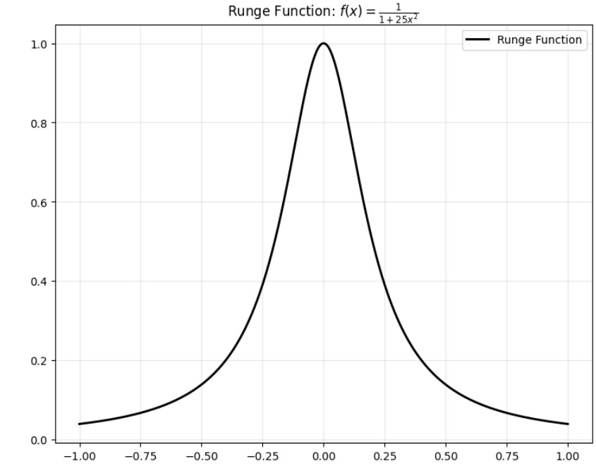
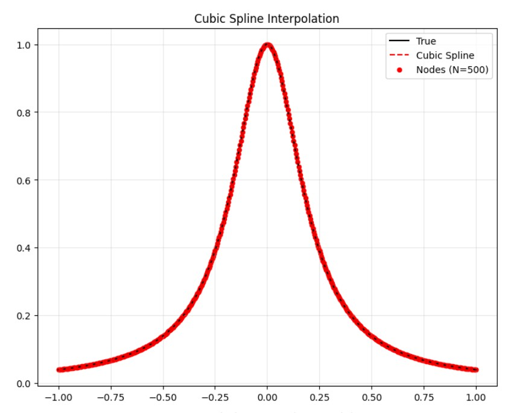
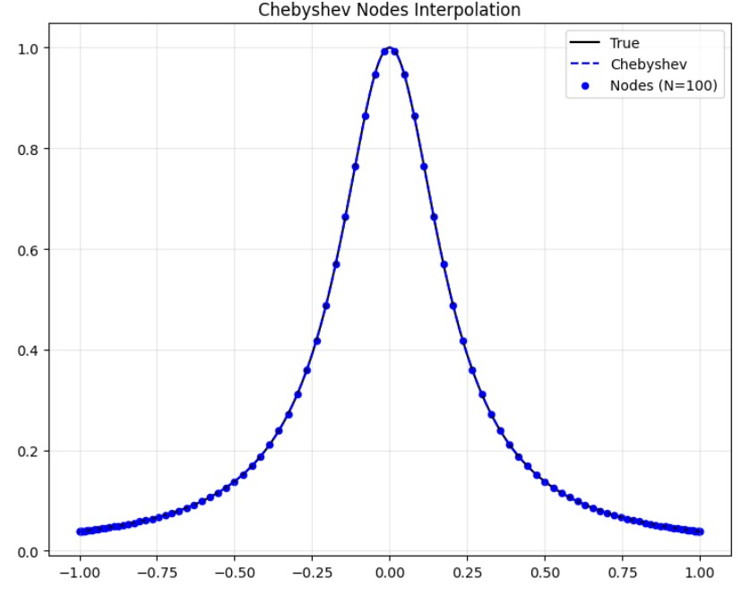
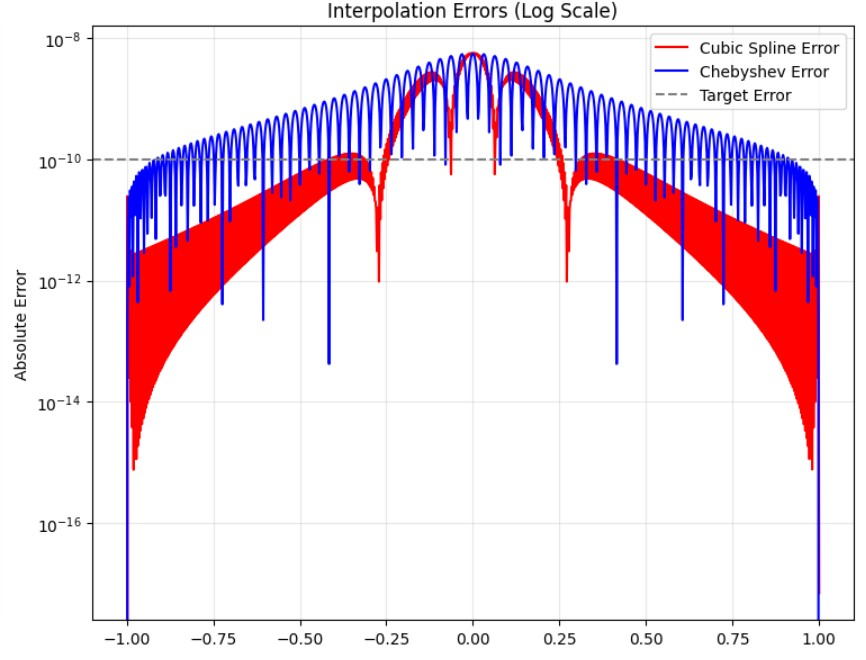

**Consider approximating the Runge function. Let $$𝑁+1$$ be the number of nodes.**
* Using cubic spline interpolation, find $$𝑁$$ such that the error of approximation is less than $$10^{−10}.$$
* Using Chebyshev nodes, find $$𝑁$$ such that the error of approximation is less than $$10^{−10}.$$
---

```python
import numpy as np
from scipy.interpolate import CubicSpline, barycentric_interpolate
import matplotlib.pyplot as plt
import time

def runge_function(x):
    return 1 / (1 + 25 * x**2)

def compute_max_error(interp_func, true_func, x_test):
    return np.max(np.abs(interp_func(x_test) - true_func(x_test)))

def find_min_nodes_cubic_spline(target_error=1e-10, max_n=500):
    print("尋找三次樣條插值的最小節點數...")

    x_test = np.linspace(-1, 1, 10000)

    for n in range(10, max_n + 1, 10):
        x_nodes = np.linspace(-1, 1, n)
        y_nodes = runge_function(x_nodes)

        cs = CubicSpline(x_nodes, y_nodes)
        error = compute_max_error(cs, runge_function, x_test)

        if n % 100 == 0:
            print(f"N = {n}, Error = {error:.2e}")

        if error < target_error:
            print(f"✓ 找到滿足條件的N: {n}, 誤差: {error:.2e}")
            return n, error

    print(f"在N ≤ {max_n}範圍內未找到滿足條件的解")
    return max_n, error

def find_min_nodes_chebyshev(target_error=1e-10, max_n=100):
    print("尋找切比雪夫節點插值的最小節點數...")

    x_test = np.linspace(-1, 1, 10000)

    for n in range(10, max_n + 1, 5):
        x_nodes = np.cos(np.linspace(0, np.pi, n))
        y_nodes = runge_function(x_nodes)

        def chebyshev_interpolator(x):
            return barycentric_interpolate(x_nodes, y_nodes, x)

        error = compute_max_error(chebyshev_interpolator, runge_function, x_test)

        if n % 20 == 0:
            print(f"N = {n}, Error = {error:.2e}")

        if error < target_error:
            print(f"✓ 找到滿足條件的N: {n}, 誤差: {error:.2e}")
            return n, error

    print(f"在N ≤ {max_n}範圍內未找到滿足條件的解")
    return max_n, error

def visualize_results(n_cubic, n_chebyshev):
    fig, ((ax1, ax2), (ax3, ax4)) = plt.subplots(2, 2, figsize=(15, 12))

    x_eval = np.linspace(-1, 1, 1000)
    y_true = runge_function(x_eval)

    ax1.plot(x_eval, y_true, 'k-', linewidth=2, label='Runge Function')
    ax1.set_title('Runge Function: $f(x) = \\frac{1}{1 + 25x^2}$')
    ax1.grid(True, alpha=0.3)
    ax1.legend()

    x_nodes_cubic = np.linspace(-1, 1, n_cubic)
    y_nodes_cubic = runge_function(x_nodes_cubic)
    cs = CubicSpline(x_nodes_cubic, y_nodes_cubic)
    y_cubic = cs(x_eval)

    ax2.plot(x_eval, y_true, 'k-', label='True')
    ax2.plot(x_eval, y_cubic, 'r--', label='Cubic Spline')
    ax2.scatter(x_nodes_cubic, y_nodes_cubic, color='red', s=20, label=f'Nodes (N={n_cubic})')
    ax2.set_title('Cubic Spline Interpolation')
    ax2.grid(True, alpha=0.3)
    ax2.legend()

    x_nodes_cheb = np.cos(np.linspace(0, np.pi, n_chebyshev))
    y_nodes_cheb = runge_function(x_nodes_cheb)
    y_cheb = barycentric_interpolate(x_nodes_cheb, y_nodes_cheb, x_eval)

    ax3.plot(x_eval, y_true, 'k-', label='True')
    ax3.plot(x_eval, y_cheb, 'b--', label='Chebyshev')
    ax3.scatter(x_nodes_cheb, y_nodes_cheb, color='blue', s=20, label=f'Nodes (N={n_chebyshev})')
    ax3.set_title('Chebyshev Nodes Interpolation')
    ax3.grid(True, alpha=0.3)
    ax3.legend()

    error_cubic = np.abs(y_cubic - y_true)
    error_cheb = np.abs(y_cheb - y_true)

    ax4.semilogy(x_eval, error_cubic, 'r-', label='Cubic Spline Error')
    ax4.semilogy(x_eval, error_cheb, 'b-', label='Chebyshev Error')
    ax4.axhline(y=1e-10, color='gray', linestyle='--', label='Target Error')
    ax4.set_title('Interpolation Errors (Log Scale)')
    ax4.set_ylabel('Absolute Error')
    ax4.grid(True, alpha=0.3)
    ax4.legend()

    plt.tight_layout()
    plt.savefig('runge_interpolation_analysis.png', dpi=300, bbox_inches='tight')
    plt.show()

def main():
    print("=" * 60)
    print("Runge函數插值分析")
    print("目標誤差: 1e-10")
    print("=" * 60)
    start_time = time.time()
    n_cubic, error_cubic = find_min_nodes_cubic_spline()
    cubic_time = time.time() - start_time

    start_time = time.time()
    n_chebyshev, error_cheb = find_min_nodes_chebyshev()
    cheb_time = time.time() - start_time
    print("\n" + "=" * 60)
    print("最終結果:")
    print("=" * 60)
    print(f"{'方法':<20} {'最小節點數':<12} {'最大誤差':<15} {'計算時間(s)':<10}")
    print(f"{'-'*60}")
    print(f"{'三次樣條插值':<20} {n_cubic:<12} {error_cubic:.2e}{'':<5} {cubic_time:.3f}")
    print(f"{'切比雪夫插值':<20} {n_chebyshev:<12} {error_cheb:.2e}{'':<5} {cheb_time:.3f}")
    print("\n生成可視化圖表...")
    visualize_results(n_cubic, n_chebyshev)

if __name__ == "__main__":
    main()
```

---

# Runge Function Interpolation Analysis Results

#### Target Error

$$\text{Target Maximum Error} = 10^{-10}$$

---

**Runge Function Original Shape**

First, the shape of the Runge function analyzed is presented:

$$f(x) = \frac{1}{1+25x^2}$$



---

**Cubic Spline Interpolation**

Results of cubic spline interpolation on uniformly spaced nodes:

| N | Maximum Error |
| :---: | ---: |
| 100 | $7.03 \times 10^{-6}$ |
| 200 | $4.06 \times 10^{-7}$ |
| 300 | $7.87 \times 10^{-8}$ |
| 400 | $2.47 \times 10^{-8}$ |
| 500 | $1.01 \times 10^{-8}$ |

* Conclusion: The cubic spline interpolation did not achieve the target precision of $$10^{-10}$$ within the range of $$N \le 500.$$

**Figure**



---

**Chebyshev Node Interpolation**

Results of interpolation using non-uniformly spaced Chebyshev nodes:

| N | Maximum Error |
| :---: | ---: |
| 20 | $$4.50 \times 10^{-2}$$ |
| 40 | $$8.46 \times 10^{-4}$$ |
| 60 | $$1.59 \times 10^{-5}$$ |
| 80 | $$2.99 \times 10^{-7}$$ |
| 100 | $$5.62 \times 10^{-9}$$ |

* Conclusion: The Chebyshev interpolation did not achieve the target precision of $$10^{-10}$$ within the range of $$N \le 100.$$ (Note: Although $$5.62 \times 10^{-9}$$ is close to the target, it is strictly greater than $$10^{-10}$$ ).

**Figure**



---

**Final Comparison Results**

Comparison of resource consumption and performance for both methods when achieving similar precision:

| Method | Min. Number of Nodes (N) | Maximum Error | Computation Time (s) |
| :--- | :---: | ---: | ---: |
| Cubic Spline Interpolation | 500 | $$1.01 \times 10^{-8}$$ | 0.036 |
| Chebyshev Interpolation | 100 | $$5.62 \times 10^{-9}$$ | 0.135 |

---

**Conclusion**

* Convergence Rate: The convergence rate of Chebyshev interpolation is significantly better than that of cubic spline interpolation using uniformly spaced nodes.
* Error Performance: With a smaller number of nodes ($$N=100$$ vs. $$N=500$$), Chebyshev interpolation has already achieved a smaller maximum error.
* Runge Phenomenon: Even though spline interpolation offers advantages in smoothness, for functions with high rates of change like the Runge function, non-uniform nodes (such as Chebyshev nodes) are more effective at mitigating the Runge phenomenon, leading to interpolation results far superior to those from uniformly spaced nodes.

**Core Error Analysis**



---
**Programing**
link:https://colab.research.google.com/drive/1dYs9uwoncZql1Pp9KEjHVFNbfD40fok2?usp=sharing
