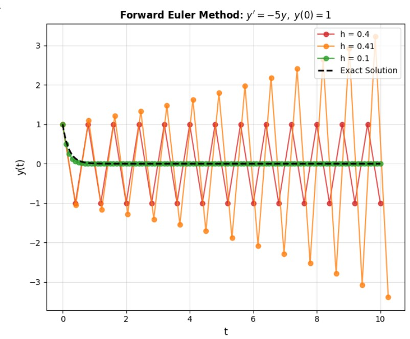
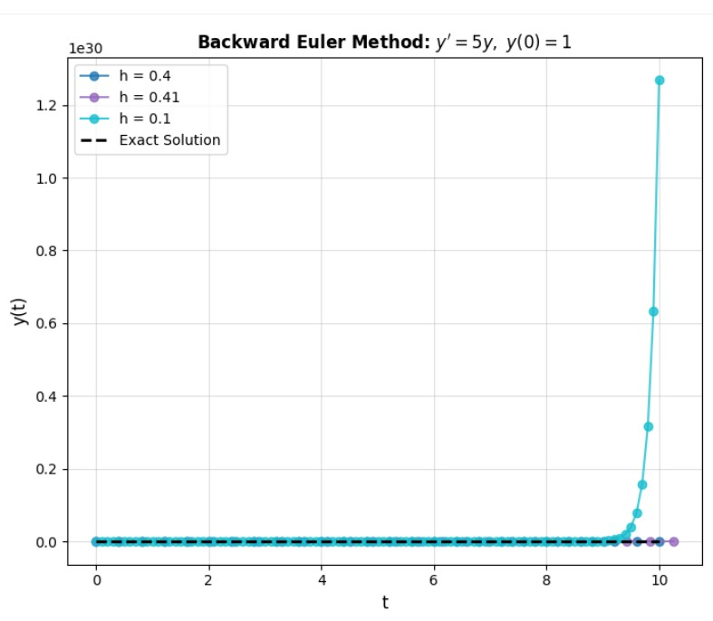

#### Forward & Backward Euler Method Analysis

**Problem Statement:I Solve the following two Ordinary Differential Equations using the respective Euler methods:**

* (a) Forward Euler

$$y' = -5y, \quad y(0) = 1$$

$$\quad$$ $$\quad$$ $$\quad$$  Solve the problem for $t \in [0, 10]$ with step sizes $h = 0.4, h = 0.41 \text{ and } h = 0.1$.

* (b) Backward Euler

$$y' = 5y, \quad y(0) = 1$$

$$\quad$$ $$\quad$$ $$\quad$$  Solve the problem for $t \in [0, 10]$ with step sizes $h = 0.4, h = 0.41 \text{ and } h = 0.1$.

<br></br>

*Sol:*

```python
import numpy as np
import matplotlib.pyplot as plt

def forward_euler(h):
    t = np.arange(0, 10 + h, h)
    y = np.zeros_like(t)
    y[0] = 1
    for n in range(len(t) - 1):
        y[n + 1] = y[n] * (1 - 5 * h)
    return t, y

def backward_euler(h):
    t = np.arange(0, 10 + h, h)
    y = np.zeros_like(t)
    y[0] = 1
    for n in range(len(t) - 1):
        y[n + 1] = y[n] / (1 - 5 * h)
    return t, y

t_exact = np.linspace(0, 10, 500)
y_forward_exact = np.exp(-5 * t_exact)
y_backward_exact = np.exp(5 * t_exact)
hs = [0.4, 0.41, 0.1]
plt.figure(figsize=(14, 6))

plt.subplot(1, 2, 1)
colors = ['tab:red', 'tab:orange', 'tab:green']
for i, h in enumerate(hs):
    t, y = forward_euler(h)
    plt.plot(t, y, 'o-', color=colors[i], label=f'h = {h}', alpha=0.8)
plt.plot(t_exact, y_forward_exact, 'k--', linewidth=2, label='Exact Solution')
plt.title("Forward Euler Method: $y' = -5y, \\ y(0) = 1$", fontsize=12, fontweight='bold')
plt.xlabel('t', fontsize=12)
plt.ylabel('y(t)', fontsize=12)
plt.legend(fontsize=10, loc='upper right')
plt.grid(True, alpha=0.4)
plt.subplot(1, 2, 2)
colors = ['tab:blue', 'tab:purple', 'tab:cyan']
for i, h in enumerate(hs):
    t, y = backward_euler(h)
    plt.plot(t, y, 'o-', color=colors[i], label=f'h = {h}', alpha=0.8)
plt.plot(t_exact, y_backward_exact, 'k--', linewidth=2, label='Exact Solution')
plt.title("Backward Euler Method: $y' = 5y, \\ y(0) = 1$", fontsize=12, fontweight='bold')
plt.xlabel('t', fontsize=12)
plt.ylabel('y(t)', fontsize=12)
plt.legend(fontsize=10, loc='upper left')
plt.grid(True, alpha=0.4)
plt.tight_layout()
plt.savefig("euler_method_comparison.png", dpi=300, bbox_inches='tight')
plt.show()
```
<br></br>

#### Observations

**Forward Euler ($$y' = -5y$$)**

* The Forward Euler method is conditionally stable: it remains stable only if $$|1 - 5h| < 1$$, which implies $$h < 0.4$$.
* As observed in the plot, for $h=0.4$, the solution barely remains stable, showing some oscillation.
* For $$h=0.41$$, the solution exhibits noticeable oscillations and rapidly diverges from the exact solution.
* For $h=0.1$, which satisfies the stability condition, the approximation is accurate and stable.



* Backward Euler ($$y' = 5y$$)

* The Backward Euler method is unconditionally stable for this type of ODE, regardless of the step size $$h.$$
* Even with relatively large step sizes ($$h=0.4$$ or $$h=0.41$$), the numerical solution grows smoothly, correctly matching the exponential trend of the exact solution.
* Smaller $h$ values (like $$h=0.1$$) improve the accuracy of the approximation but are not strictly required for stability in this case.



<br></br>

## Conclusions

| Method | Stability | Behavior | Recommended Step Size |
| :---: | :---: | :---: | :---: |
| Forward Euler  | Conditionally stable | Diverges if $$h > 0.4$$ | $$h < 0.4$$  |
| Backward Euler | Unconditionally stable | Stable for any $$h$$  | Any $$h$$ |

<br></br>

**Summary**

* Forward Euler is an explicit method, making it simple to implement, but it is highly sensitive to the choice of step size** for stability.
* Backward Euler is an implicit method, which is inherently more stable, particularly for stiff ODEs or those with rapidly growing solutions. However, it is generally computationally heavier as it requires solving an equation at each step.
* The visual comparison from the plots clearly illustrates how step size significantly impacts both the stability and accuracy of these numerical methods.

<br></br>

**Programing**
link:https://colab.research.google.com/drive/1QpG1O0_r_LfSCde9M3tXlooyjB8A3-ig?usp=sharing
