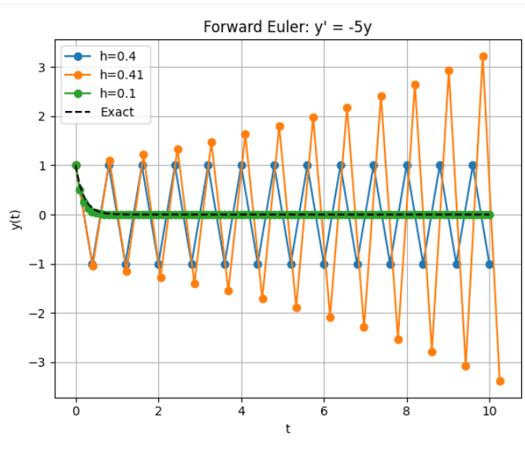
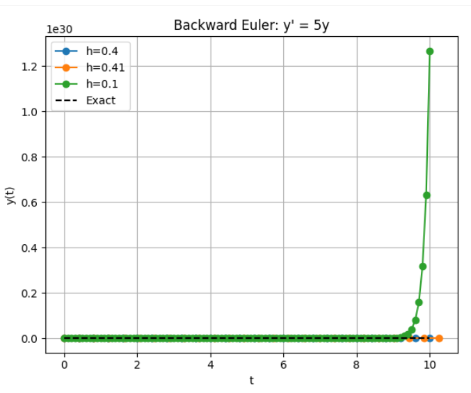

**Ⅰ. Forward Euler Method**
```python
def forward_euler(h):
    t = np.arange(0, 10 + h, h)
    y = np.zeros(len(t))
    y[0] = 1
    for n in range(len(t) - 1):
        y[n+1] = y[n] * (1 - 5*h)
    return t, y
```
```python
plt.subplot(1,2,1)
for h in hs:
    t, y = forward_euler(h)
    plt.plot(t, y, 'o-', label=f'h={h}')
plt.plot(t_exact, y_forward_exact, 'k--', label='Exact')
plt.title('Forward Euler: y\' = -5y')
plt.xlabel('t'); plt.ylabel('y(t)')
plt.legend(); plt.grid(True)
```

**Forward Euler Result Analysis**

<table>
<tr>
<td width="45%">

</td>
<td width="55%">

**Explanation**

For the differential equation $$y' = -5y, y(0) = 1$$ the analytical solution is $$y(t) = e^{-5t},$$ ,which represents a rapid exponential decay. 

As $$t \to \infty$$, we have $$y(t) \to 0$$.

The Forward Euler method gives: $$y_{n+1} = y_n + h f(t_n, y_n) = y_n + h (-5y_n)$$ .

---

**Stability Analysis**

To ensure numerical stability, the amplification factor must satisfy $$|\mathbf{1 - 5h}| \le 1.$$

This leads to the stability condition $$-1 \le 1 - 5h \le 1 \quad \Rightarrow \quad \mathbf{0 \le h \le 0.4.}$$

---

**Result Observations**

* When $$h = 0.1$$: $$|1 - 5h| = 0.5 < 1 →$$  
  The numerical solution closely matches the analytical one and shows smooth exponential decay.
* When $$h = 0.4$$: $$|1 - 5h| = 0 →$$
  The numerical solution becomes critically stable, reaching zero in a single step.
* When $$h = 0.41$$: $$|1 - 5h| = 1.05 > 1$$ →  
  The solution starts to oscillate and diverge, demonstrating instability.

---

**Conclusion**

This clearly shows that the Forward Euler method exhibits conditional stability.  
For problems such as $$y' = \lambda y $$ with large negative $$\lambda$$ , the method is stable only if the step size $$h$$ satisfies strict limits.


</td>
</tr>
</table>


---

**Ⅱ. Backward Euler Method**

```python
def backward_euler(h):
    t = np.arange(0, 10 + h, h)
    y = np.zeros(len(t))
    y[0] = 1
    for n in range(len(t) - 1):
        y[n+1] = y[n] / (1 - 5*h)
    return t, y
```
```python
plt.subplot(1,2,2)
for h in hs:
    t, y = backward_euler(h)
    plt.plot(t, y, 'o-', label=f'h={h}')
plt.plot(t_exact, y_backward_exact, 'k--', label='Exact')
plt.title('Backward Euler: y\' = 5y')
plt.xlabel('t'); plt.ylabel('y(t)')
plt.legend(); plt.grid(True)
```
**Backward Euler Result Analysis**

<table>
<tr>
<td width="45%">

</td>
<td width="55%">

**Backward Euler Method Stability Analysis**

For the differential equation $$y' = 5y, \quad y(0) = 1$$
the analytical solution is $$y(t) = e^{5t}$$ ,which represents a rapid exponential growth as $$t$$ increases.

---
**Iterative Formula**

The Backward Euler method gives:
$$y_{n+1} = y_n + h f(t_{n+1}, y_{n+1}) = y_n + h (5y_{n+1})$$

Solving for $$y_{n+1}$$ : $$\mathbf{y_{n+1} = \frac{y_n}{1 - 5h}.}$$

---

**Stability Analysis**

For a general linear test equation $$y' = \lambda y$$ ,the amplification factor of the Backward Euler method is $$G = \mathbf{\frac{1}{1 - \lambda h}}$$ .

When $$\text{Re}(\lambda) < 0$$ ,we have $$\left|\frac{1}{1 - \lambda h}\right| < 1 \quad\text{for any } h > 0$$.

---

**Result Observations**

In this problem, we have $$\mathbf{\lambda = 5 > 0}$$, and the analytical solution $$y(t) = e^{5t}$$ diverges exponentially. Therefore, the numerical solution should also grow rapidly.

* When $$h = 0.1$$:  
  The numerical solution closely follows the exponential growth of the analytical solution,reaching very large values by $$t = 10$$.

* When $$h = 0.4$$   or   $$h = 0.41$$ :
  The growth rate is underestimated because $$|1 - 5h|$$ becomes small or negative, causing $$y_{n+1}$$ to deviate from the analytical trajectory.  
  However, unlike Forward Euler, no oscillatory divergence occurs.

---

**Conclusion**

When $$\lambda < 0$$, it remains numerically stable for any step size $$h$$ ,avoiding oscillations or divergence even for stiff problems.

For $$\lambda > 0$$ , the analytical solution itself diverges, so the numerical solution should also diverge ,but Backward Euler still preserves smooth, non-oscillatory behavior, whereas Forward Euler tends to oscillate and blow up.

</td>
</tr>
</table>

---
**Programing**
link:https://colab.research.google.com/drive/1QpG1O0_r_LfSCde9M3tXlooyjB8A3-ig?usp=sharing
