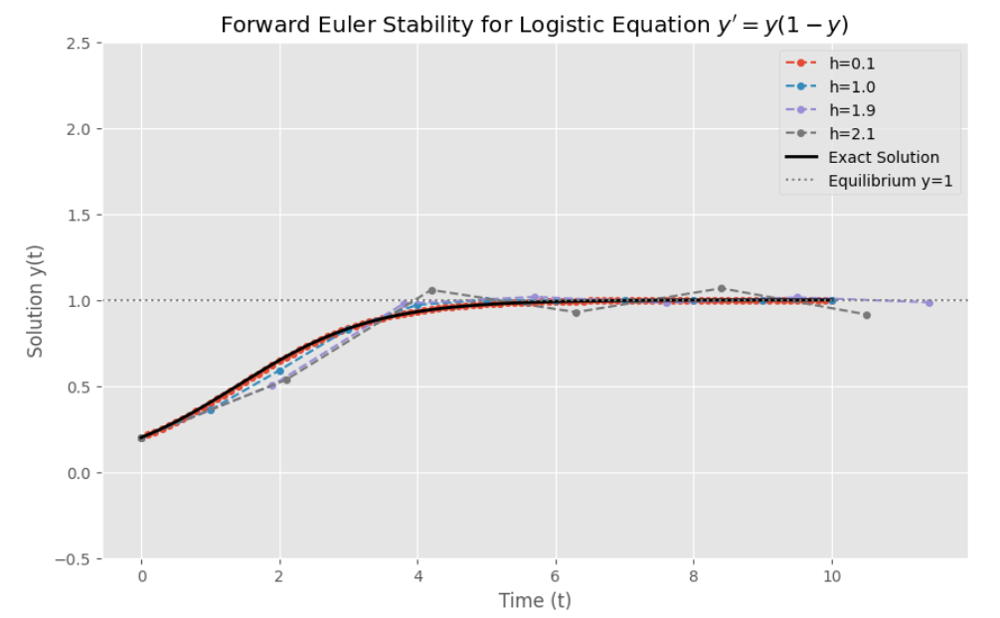

Consider solving the following problem using forward Euler method

$$y' = y(1 - y), \quad y(0) = y_0, \quad 0 < y_0 < 1.$$

Find the range of $h$ such that the solution is qualitatively correct.

<br></br>

**Sol:**
```python
import numpy as np
import matplotlib.pyplot as plt

def f_logistic(y):
    return y * (1 - y)

def forward_euler_logistic(y0, h, t_end=10):

    t = np.arange(0, t_end + h, h)
    y = np.zeros(len(t))
    y[0] = y0
    
    for n in range(len(t) - 1):
        y[n+1] = y[n] + h * f_logistic(y[n])
    
    return t, y

y0 = 0.2
hs = [0.1, 1.0, 1.9, 2.1] 
t_exact = np.linspace(0, 10, 500)
y_exact = 1 / (1 + ((1 - y0) / y0) * np.exp(-t_exact))
plt.figure(figsize=(10, 6))
plt.style.use('ggplot')
for h in hs:
    t, y = forward_euler_logistic(y0, h)
    plt.plot(t, y, 'o--', ms=4, label=f'h={h}')

plt.plot(t_exact, y_exact, 'k-', linewidth=2, label='Exact Solution')

plt.xlabel('Time (t)')
plt.ylabel('Solution y(t)')
plt.title('Forward Euler Stability for Logistic Equation $y\' = y(1 - y)$')
plt.axhline(y=1, color='gray', linestyle=':', label='Equilibrium y=1')
plt.legend()
plt.grid(True)
plt.ylim(-0.5, 2.5) 
plt.show()
```
#### Stability Analysis of Forward Euler for the Logistic Equation


**Conclusion**

By performing a linearization around the stable equilibrium point $y=1$ and applying the Forward Euler stability condition, we find the range of $$h:$$

* Linearization: The derivative of $$f(y)$$ is $$f'(y) = 1 - 2y.$$
    At the equilibrium $$y=1$$ , the slope (eigenvalue) is $$\lambda = f'(1) = -1.$$

* Forward Euler Stability Condition:For the linear ODE $$y'=\lambda y$$ , the Forward Euler method is stable if
    $$|1 + h\lambda| < 1.$$

* Applying the Condition: Substituting $$\lambda = -1:$$
    $$|1 - h| < 1 \quad\Rightarrow\quad -1 < 1 - h < 1 \quad\Rightarrow\quad -2 < -h < 0 \quad\Rightarrow\quad 0 < h < 2.$$

Therefore, to correctly approximate the solution qualitatively (i.e., converge to $y=1$), the step size must satisfy
$$\boxed{0 < h < 2.}$$

<br></br>

**Explanation and Intuitive Understanding**

* Behavior near Equilibrium: Near the stable equilibrium $y=1$, the original non-linear equation can be approximated by the linear ODE $$z' = -1\cdot z$$ (where $$z=y-1$$). The solution in this region exponentially decays back to the equilibrium.
* Role of $$h$$: The Forward Euler method needs $$h < 2$$ to correctly simulate this exponential decay. If $$h$$ exceeds 2, the numerical amplification factor $$(1-h)$$ will have an absolute value greater than 1, causing the solution to oscillate or grow away from $$y=1$$, resulting in a qualitatively incorrect result.

<br></br>

**Numerical Examples**

Using the initial value $$y_0=0.2$$ in the Forward Euler method, the following behaviors are observed:

* $$h=0.1$$: Stable and accurate, the solution monotonically increases towards $$y=1$$.
* $$h=1.0$$: Stable, converges to $$y=1$$, but with lower accuracy.
* $$h=1.9$$: Close to the stability boundary ($$0<h<2$$), may show minor oscillation or overshoot, but remains qualitatively correct (converges to $y=1$).
* $$h=2.1$$: Exceeds the boundary ($$h>2$$), resulting in large oscillations or divergence, making the numerical solution qualitatively incorrect.



<br></br>

**Recommendations**

* For Qualitative Correctness: The step size must be $0 < h < 2$.
* For Accuracy and Stability: It is generally recommended to choose a much smaller step size, such as $h \le 0.5$ or smaller, depending on the required precision.
* For Stiff Problems: For problems with much stronger decay/growth terms (larger $|\lambda|$), an implicit method (like Backward Euler) is recommended to avoid severe restrictions on $h$.

<br></br>

**Programing**
link:https://colab.research.google.com/drive/11bV7JblL4nw54jSwVEkzq0fiji16vBYx?usp=sharing
