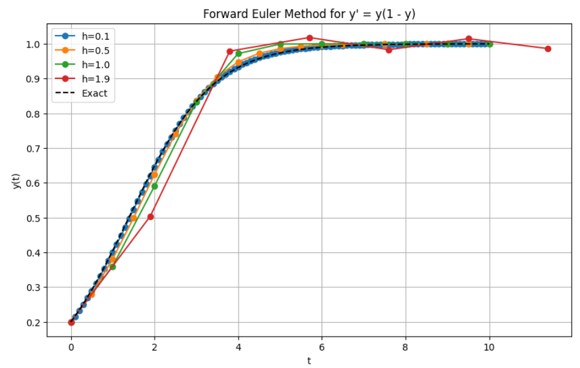

**Consider solving the following problem using forward Euler method**

$$y' = y(1-y), \quad y(0)=y_0 ,\quad 0<y_0<1$$.

**Find the range of $$ℎ$$ such that the solution is qualitatively correct.**

```python
ef forward_euler_logistic(y0, h, t_end=10):
    t = np.arange(0, t_end + h, h)
    y = np.zeros(len(t))
    y[0] = y0
    for n in range(len(t)-1):
        y[n+1] = y[n] + h * y[n] * (1 - y[n])
    return t, y

y0 = 0.2
hs = [0.1, 0.5, 1.0, 1.9]

t_exact = np.linspace(0, 10, 500)
y_exact = 1 / (1 + ((1 - y0) / y0) * np.exp(-t_exact))

plt.figure(figsize=(10,6))
for h in hs:
    t, y = forward_euler_logistic(y0, h)
    plt.plot(t, y, 'o-', label=f'h={h}')
plt.plot(t_exact, y_exact, 'k--', label='Exact')
plt.xlabel('t')
plt.ylabel('y(t)')
plt.title('Forward Euler Method for y\' = y(1 - y)')
plt.legend()
plt.grid(True)
plt.show()
```

<table>
  <tr>
  <td width="45%">

</td>
<td width="55%">

**Forward Euler Method for the Logistic Equation**

The differential equation $$y' = y(1 - y), \quad y(0) = y_0, \quad 0 < y_0 < 1$$.

The analytical solution is  $$y(t) = \frac{1}{1 + \frac{1 - y_0}{y_0} e^{-t}}$$ ,which approaches $$y = 1$$  as  $$t \to \infty$$.

The Forward Euler scheme

$$y_{n+1} = y_n + h \, y_n (1 - y_n)= y_n (1 + h - h y_n).$$

This nonlinear recurrence must preserve $$0 < y_n < 1$$ to remain qualitatively correct.

---

**Stability and Qualitative Behavior**

* Fixed points: $$y = 0$$ and $$y = 1$$.
* Linearize near each fixed point:
  * Around  $$y = 0$$ :
     $$y_{n+1} \approx (1 + h) y_n.$$
     To avoid oscillation or negative values, $$1 + h > 0  ⇒ h > -1$$.

  * Around $$y = 1$$ :  
     Let $$e_n = 1 - y_n$$ . Then $$e_{n+1} \approx (1 - h)e_n$$.
     For stability  $$e_n \to 0$$ , we require $$|1 - h| < 1 \quad \Rightarrow \quad 0 < h < 2$$.

---

**Definition of *Qualitatively Correct* Behavior**

* Boundedness:

  The numerical solution must satisfy $$0 < y_n < 1$$ for all steps.  
* Monotonic Convergence:

  The numerical solution should increase monotonically and converge to the stable fixed point $$y = 1$$ ,without oscillation or divergence.

When $$h$$ exceeds the stability limit $$h \ge 2$$ , these qualitative properties are lost.

---

**Range of $$h$$ for Qualitatively Correct Behavior**

* For $$0 < h < 2$$:  
  The solution remains stable, monotonic, and confined within $$[0,1]$$.
* For $$h > 2$$:  
  The numerical solution oscillates or diverges, violating qualitative correctness.

---

</td>
</tr>
</table>
