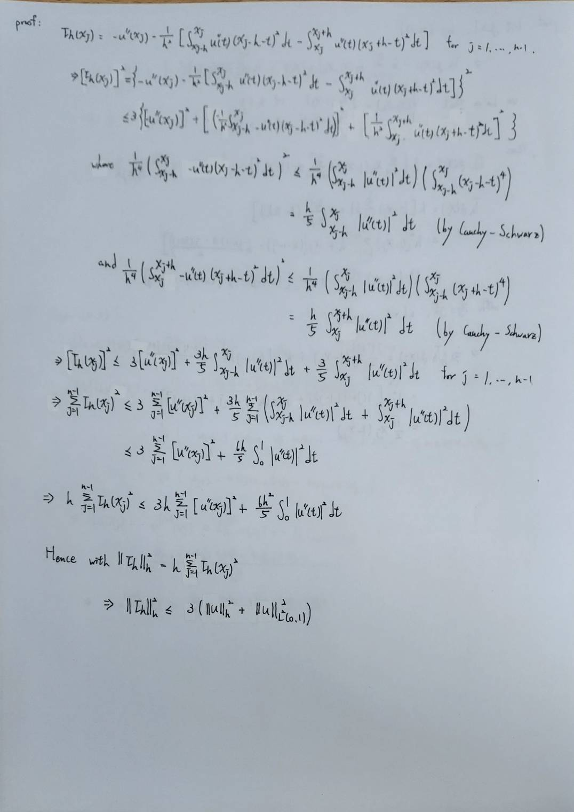

Prove the estimate (12.23).

Hint: For each internal node $$x_j, j = 1,\dots,n-1$$ , integrate by parts (12.21) to get

$$
\tau_h(x_j)
= -u''(x_j)
-\frac{1}{h^2}\left[
\int_{x_j-h}^{x_j} u''(t)(x_j-h-t)^2 dt
-\int_{x_j}^{x_j+h} u''(t)(x_j+h-t)^2 dt
\right].
$$

Then, pass to the squares and sum  $$\tau_h(x_j)^2$$  for $$j = 1,\dots,n-1.$$

Noting that

$$
(a+b+c)^2 \le 3(a^2+b^2+c^2),\quad \text{for any real numbers } a,b,c,
$$

and applying the Cauchy–Schwarz inequality yields the desired result.

  

