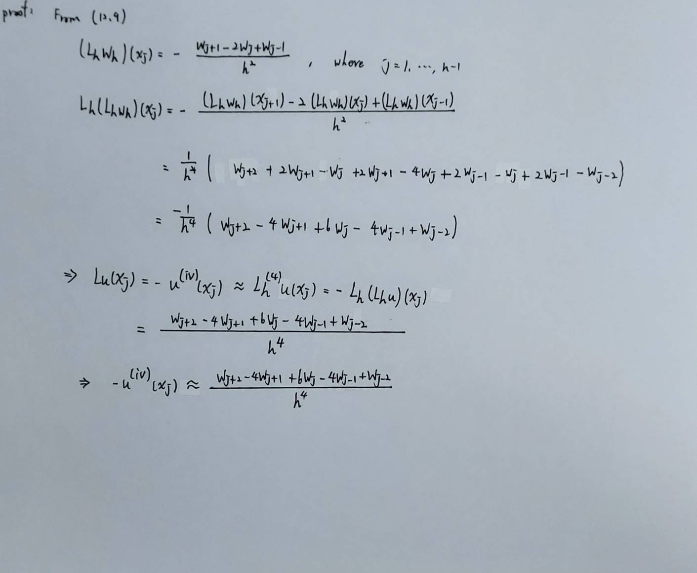

Discretize the fourth-order differential operator $$L u(x) = -u^{(iv)}(x)$$ using centered finite differences.

Solution: apply twice the second-order centered finite difference operator $$L_h$$ defined in (12.9).

  

