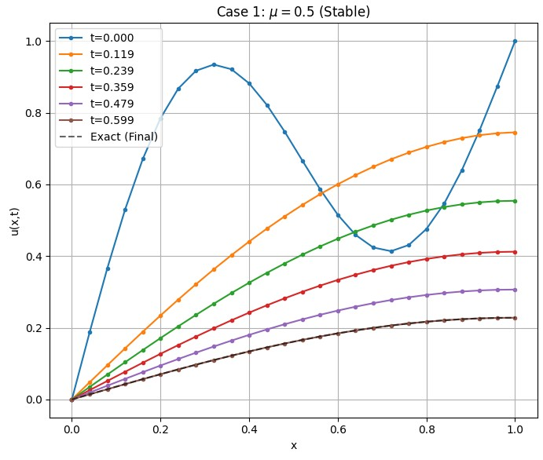
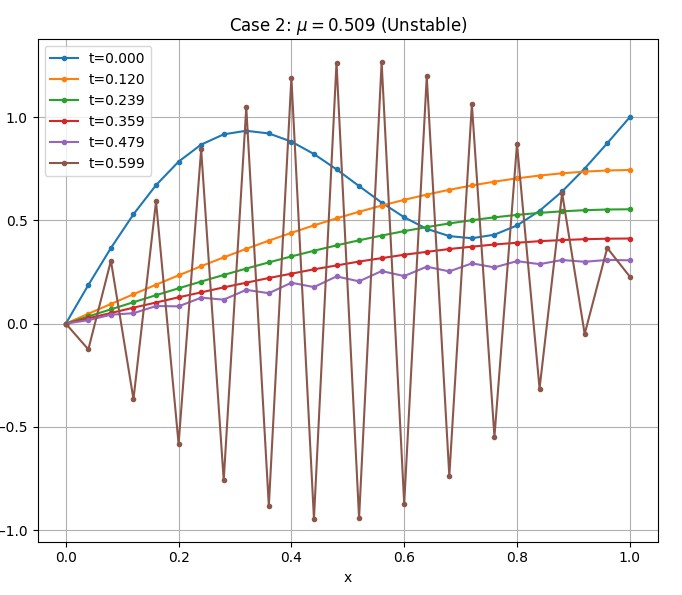

Consider the diffusion equation:

$$u_t = u_{xx}, \quad 0\le x\le 1, \quad t\ge 0$$

with initial and boundary conditions

$$u(x, 0) = \sin\left(\frac{1}{2}\pi x\right) + \frac{1}{2}\sin(2\pi x), \quad u(0, t) = 0, \quad u(1,t) = e^{-\pi^2 t/4}, \quad t\ge 0.$$

Solve the problem using Forward Euler finite difference method with $$\mu=0.5$$ and $$\mu=0.509.$$

<br></br>

**Numerical Method(Forward Euler Finite Difference Method)**

Discretization

令 $$x_i = i \Delta x$$ 且 $$t_n = n \Delta t$$。

使用向前差分近似時間導數，用中心差分近似空間導數：

$$\frac{u_i^{n+1} - u_i^n}{\Delta t} = \frac{u_{i+1}^n - 2u_i^n + u_{i-1}^n}{(\Delta x)^2}$$


Define Mesh Ratio $$\mu$$ :

$$\mu = \frac{\Delta t}{(\Delta x)^2}$$

迭代公式：

$$u_i^{n+1} = u_i^n + \mu (u_{i+1}^n - 2u_i^n + u_{i-1}^n)$$

或者寫成權重形式：

$$u_i^{n+1} = \mu u_{i+1}^n + (1 - 2\mu)u_i^n + \mu u_{i-1}^n$$

<br></br>

**Stability Analysis**

對於熱傳導/擴散方程的 Forward Euler 方法，根據 von Neumann 穩定性分析，其數值穩定條件為：

$$\mu \leq \frac{1}{2}$$

時間步長 $\Delta t$ 受到空間步長 $\Delta x$ 的嚴格限制 ($\Delta t \leq \frac{1}{2}(\Delta x)^2$)。


<br></br>

**Visualization**
```python
import numpy as np
import matplotlib.pyplot as plt

def exact_solution(x, t):
    term1 = np.exp(- (np.pi**2 * t) / 4) * np.sin(0.5 * np.pi * x)
    term2 = 0.5 * np.exp(- 4 * np.pi**2 * t) * np.sin(2 * np.pi * x)
    return term1 + term2

def solve_diffusion(mu, N=20, t_final=0.1):
    L = 1.0
    dx = L / N
    dt = mu * (dx ** 2)
    x = np.linspace(0, L, N + 1)
    num_steps = int(t_final / dt)
    u = np.sin(0.5 * np.pi * x) + 0.5 * np.sin(2 * np.pi * x)
    history = [u.copy()]
    times = [0.0]
    current_time = 0.0
    

    for n in range(num_steps):
        u_new = np.zeros_like(u)
        u_new[1:-1] = u[1:-1] + mu * (u[2:] - 2*u[1:-1] + u[:-2])
        current_time += dt
        u_new[0] = 0.0
        u_new[-1] = np.exp(- (np.pi**2 * current_time) / 4)
        u = u_new
        history.append(u.copy())
        times.append(current_time)

    return x, history, times

N_points = 25 
T_end = 0.6   

mu_stable = 0.5
mu_unstable = 0.509

x, sol_stable, t_stable = solve_diffusion(mu_stable, N_points, T_end)
x, sol_unstable, t_unstable = solve_diffusion(mu_unstable, N_points, T_end)

fig, axes = plt.subplots(1, 2, figsize=(14, 6))

axes[0].set_title(f"Case 1: $\mu = {mu_stable}$ (Stable)")
plot_indices = np.linspace(0, len(sol_stable)-1, 6, dtype=int)
for i in plot_indices:
    axes[0].plot(x, sol_stable[i], '.-', label=f't={t_stable[i]:.3f}')

axes[0].plot(x, exact_solution(x, t_stable[-1]), 'k--', alpha=0.6, label='Exact (Final)')
axes[0].grid(True)
axes[0].set_xlabel('x')
axes[0].set_ylabel('u(x,t)')
axes[0].legend()


axes[1].set_title(f"Case 2: $\mu = {mu_unstable}$ (Unstable)")
plot_indices = np.linspace(0, len(sol_unstable)-1, 6, dtype=int)
for i in plot_indices:
    axes[1].plot(x, sol_unstable[i], '.-', label=f't={t_unstable[i]:.3f}')
axes[1].grid(True)
axes[1].set_xlabel('x')
axes[1].set_ylabel('u(x,t)')
axes[1].legend()

plt.tight_layout()
plt.show()

```
使用 $$N=25$$ 進行空間切分，並比較兩種不同的 $$\mu$$ 值：


<table>
  <tr>
    <td style="vertical-align: top;">
      
    </td>
    <td style="vertical-align: top; padding-right: 20px;">
    <p><strong>左圖 ($$\mu = 0.5$$):</strong></p>
      <p>* 解曲線保持光滑 (Smooth)。</p>
      <p>* 數值解與物理預期相符，隨著時間 $t$ 增加，波幅逐漸衰減並滿足邊界條件。</p>
    </td>
  </tr>
</table>

<br></br>

<table>
  <tr>
    <td style="vertical-align: top;">
      
    </td>
    <td style="vertical-align: top; padding-right: 20px;">
    <p><strong>左圖 ($$\mu = 0.509$$):</strong></p>
      <p>* 在初始的幾步可能看起來還正常。</p>
      <p>* 隨時間推進，曲線開始出現高頻振盪。</p>
      <p>* 出現「鋸齒狀」圖形，且振幅越來越大，這是典型的數值不穩定現象。</p>
    </td>
  </tr>
</table>

這證實了即使 $$\mu$$ 只是稍微超過 $$0.5$$ (例如 $$0.509$$)，顯式差分法也會完全失效。

<br></br>

**Programing**

link:https://colab.research.google.com/drive/1ikhFfJUNIg7Q_s8juDC4WuKhRIsGeKw_?usp=sharing
