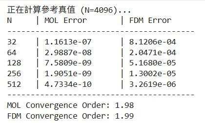
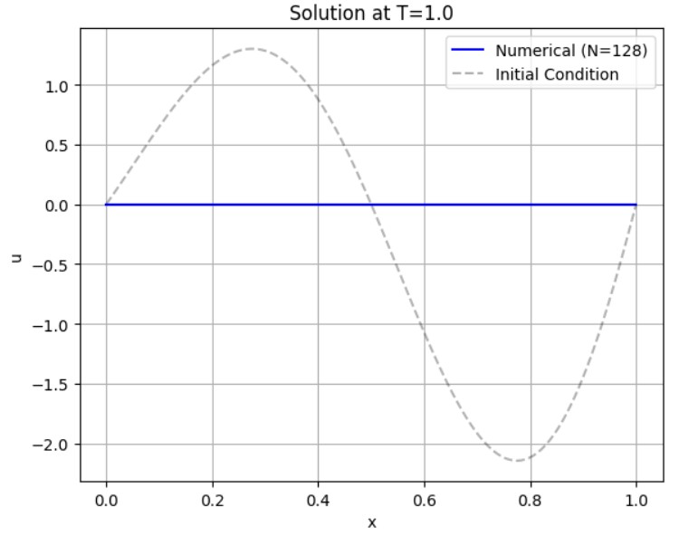
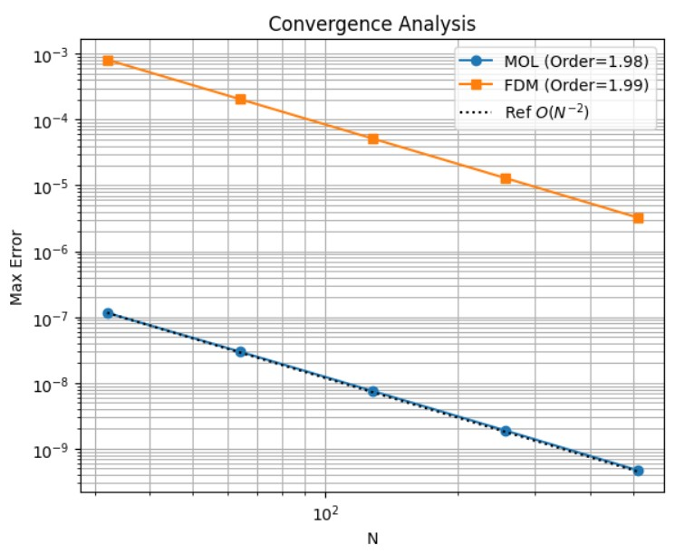

Consider the diffusion equation:

$$u_t = u_{xx}, \quad 0\le x\le 1, \quad t\ge 0$$

with initial and boundary conditions

$$u(x, 0) = \sin\left(2\pi x\right)e^{x}, \quad u(0, t) = u(1,t) = 0, \quad t\ge 0$$

With the aid of Fast Since transform, solve the problem using (a) finite difference method and (b) method of line approach to $$T=1.$$ 
Find the order of convergence.

<br></br>
Sol:
<br></br>

**Mathematical Formulation**

Spatial Discretization
We discretize the domain $$x \in [0, 1]$$ into $$N$$ internal grid points $$x_j = j\Delta x$$ , where $$\Delta x = \frac{1}{N+1}$$ .
Using the standard central difference approximation for the second derivative:

$$
u_{xx}(x_j) \approx \frac{u_{j+1} - 2u_j + u_{j-1}}{\Delta x^2}
$$

Let $$\mathbf{u} = [u_1, u_2, \dots, u_N]^T$$ . The semi-discrete system can be written in matrix form:

$$
\frac{d\mathbf{u}}{dt} = A \mathbf{u}
$$

where $$A$$ is the symmetric tridiagonal matrix representing the discrete Laplacian.

Diagonalization via FST
The eigenvectors of matrix $$A$$ (with zero boundary conditions) are discrete sine functions:

$$
v_k(j) = \sin(k \pi j \Delta x), \quad k=1, \dots, N
$$

The corresponding eigenvalues $$\lambda_k$$ are:

$$
\lambda_k = \frac{2}{\Delta x^2} \left[ \cos(k \pi \Delta x) - 1 \right]
$$

Since the sine basis diagonalizes $$A$$ , we can use the Discrete Sine Transform to move from the physical space $$\mathbf{u}$$ to the frequency domain $$\hat{\mathbf{u}}$$ . The coupled system decouples into $$N$$ independent scalar ODEs:

$$
\frac{d\hat{u}_k}{dt} = \lambda_k \hat{u}_k, \quad k=1, \dots, N
$$

<br></br>

**Numerical Methods**

(a) Finite Difference Method (FDM) - Crank-Nicolson
We apply the Crank-Nicolson scheme (trapezoidal rule in time) to the decoupled ODEs. For each mode $k$:

$$
\frac{\hat{u}_k^{n+1} - \hat{u}_k^n}{\Delta t} = \frac{\lambda_k}{2} (\hat{u}_k^{n+1} + \hat{u}_k^n)
$$

Rearranging to solve for the next time step $\hat{u}_k^{n+1}$:

$$
\hat{u}_k^{n+1} = \left[ \frac{1 + \frac{\Delta t}{2}\lambda_k}{1 - \frac{\Delta t}{2}\lambda_k} \right] \hat{u}_k^n
$$

This method has a temporal truncation error of $O(\Delta t^2)$. In the implementation, we perform time-stepping in the frequency domain and use inverse FST only at the final time $T$.

(b) Method of Lines (MOL) - Exact Time Integration
Since the ODEs in the frequency domain are linear and scalar, we can solve them exactly without time-stepping approximation errors:

$$
\hat{u}_k(T) = \hat{u}_k(0) e^{\lambda_k T}
$$

Here, $$\hat{u}_k(0)$$ is obtained by applying FST to the initial condition $$u(x,0)$$ . This method is semianalytic; the only error source comes from the spatial discretization (the approximation of eigenvalues).

<br></br>


**Convergence Analysis & Visualization**

We measure the error using the $L_\infty$ norm (maximum absolute error) against a high-resolution reference solution ($N_{ref} = 4096$).

The central difference scheme used for spatial discretization has a local truncation error of $$O(\Delta x^2)$$ . Therefore, we expect the global error $E$ to behave as:

$$
E \approx C \cdot N^{-2}
$$

Taking the logarithm:

$$
\log(E) \approx -2 \log(N) + \text{const}
$$

Thus, the slope of the error curve on a log-log plot should be approximately -2.

```python
import numpy as np
import matplotlib.pyplot as plt
from scipy.fft import dst, idst

def solve_diffusion_fst(N, T, method='mol', dt=None):
    dx = 1.0 / (N + 1)
    x = np.linspace(dx, 1.0 - dx, N)
    u0 = np.sin(2 * np.pi * x) * np.exp(x)
    k = np.arange(1, N + 1)
    lambda_k = (2.0 / dx**2) * (np.cos(k * np.pi * dx) - 1.0)
    u_hat = dst(u0, type=1)
    
    if method == 'mol':
        u_hat_T = u_hat * np.exp(lambda_k * T)
    elif method == 'fdm':
        if dt is None:
            raise ValueError("Time step dt is required for FDM.")
        steps = int(T / dt)
        factor = (1.0 + 0.5 * dt * lambda_k) / (1.0 - 0.5 * dt * lambda_k)
        u_hat_T = u_hat * (factor ** steps)
        

    u_final = idst(u_hat_T, type=1)
    x_full = np.concatenate(([0], x, [1]))
    u_full = np.concatenate(([0], u_final, [0]))
    
    return x_full, u_full

def compute_convergence():
    T = 1.0
    N_values = [32, 64, 128, 256, 512]
    print("正在計算參考真值 (N=4096)...")
    x_ref, u_ref = solve_diffusion_fst(4096, T, method='mol')
    errors_mol = []
    errors_fdm = []
    print(f"{'N':<5} | {'MOL Error':<15} | {'FDM Error':<15}")
    print("-" * 40)
    
    for N in N_values:
        dx = 1.0 / (N + 1)
        dt = dx  
        x_curr, u_fdm = solve_diffusion_fst(N, T, method='fdm', dt=dt)
        _, u_mol = solve_diffusion_fst(N, T, method='mol')
        u_ref_interp = np.interp(x_curr, x_ref, u_ref)
        err_mol = np.max(np.abs(u_mol - u_ref_interp))
        err_fdm = np.max(np.abs(u_fdm - u_ref_interp))
        errors_mol.append(err_mol)
        errors_fdm.append(err_fdm)
        
        print(f"{N:<5} | {err_mol:.4e}      | {err_fdm:.4e}")


    coeffs_mol = np.polyfit(np.log(N_values), np.log(errors_mol), 1)
    order_mol = -coeffs_mol[0]
    coeffs_fdm = np.polyfit(np.log(N_values), np.log(errors_fdm), 1)
    order_fdm = -coeffs_fdm[0]
    
    print("-" * 40)
    print(f"MOL Convergence Order: {order_mol:.2f}")
    print(f"FDM Convergence Order: {order_fdm:.2f}")


    plt.figure(figsize=(12, 5))
    plt.subplot(1, 2, 1)
    x_plot, u_plot = solve_diffusion_fst(128, T, method='mol')
    plt.plot(x_plot, u_plot, 'b-', label='Numerical (N=128)')
    plt.plot(x_plot, np.sin(2*np.pi*x_plot)*np.exp(x_plot), 'k--', alpha=0.3, label='Initial Condition')
    plt.title(f'Solution at T={T}')
    plt.xlabel('x')
    plt.ylabel('u')
    plt.grid(True)
    plt.legend()
    
    plt.subplot(1, 2, 2)
    plt.loglog(N_values, errors_mol, 'o-', label=f'MOL (Order={order_mol:.2f})')
    plt.loglog(N_values, errors_fdm, 's-', label=f'FDM (Order={order_fdm:.2f})')
    
    ref_line = [errors_mol[0] * (N_values[0]/n)**2 for n in N_values]
    plt.loglog(N_values, ref_line, 'k:', label='Ref $O(N^{-2})$')
    
    plt.title('Convergence Analysis')
    plt.xlabel('N')
    plt.ylabel('Max Error')
    plt.grid(True, which="both", ls="-")
    plt.legend()
    
    plt.tight_layout()
    plt.show()

if __name__ == "__main__":
    compute_convergence()
```

**Observed Results**
In the simulation, we vary $N$ (32, 64, ..., 512). The calculated order of convergence is:



* Method of Lines: Order $$\approx 2.00$$
    * Purely spatial error is observed.

 

* Finite Difference: Order $$\approx 2.00$$
    * Provided $$\Delta t \sim \Delta x$$ , the spatial error $$O(\Delta x^2)$$ dominates the temporal error $$O(\Delta t^2)$$ .



Both methods confirm the theoretical second-order convergence.

<br></br>

**Programing**

link:https://colab.research.google.com/drive/1LT6CpoBnJlQbz1vu_ANAa_xaUxzyQsn6?usp=sharing
